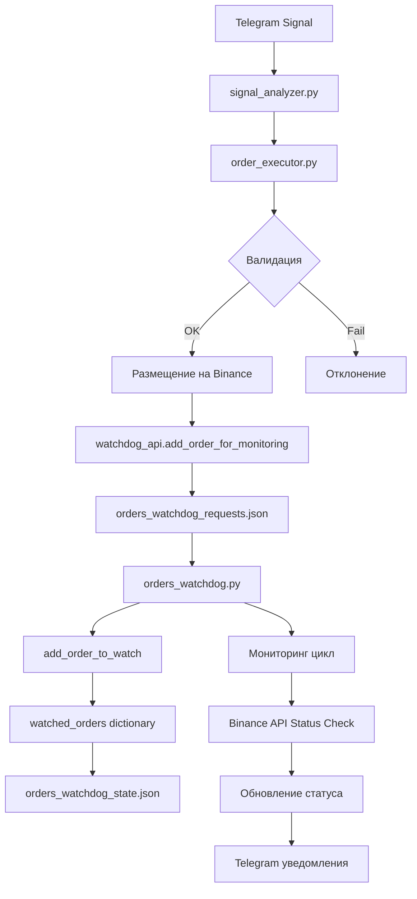

# 🏗️ Архитектура обработки ордеров в PATRIOT Trading System

## Общий обзор

Система PATRIOT использует двухуровневую архитектуру для обработки ордеров:
1. **Order Executor** - создание и размещение ордеров на Binance
2. **Orders Watchdog** - мониторинг и управление жизненным циклом ордеров

## 📋 Компоненты системы

### 1. Order Executor (`order_executor.py`)
**Назначение**: Создание, валидация и размещение ордеров на Binance Futures API

**Ключевые функции**:
- Валидация сигналов
- Проверка лимитов (`MAX_CONCURRENT_ORDERS`)
- Размещение ордеров на Binance
- Передача ордеров в Orders Watchdog

### 2. Orders Watchdog (`orders_watchdog.py`)
**Назначение**: Мониторинг, отслеживание и управление жизненным циклом ордеров

**Ключевые функции**:
- Регистрация новых ордеров
- Мониторинг статуса ордеров
- Управление SL/TP ордерами
- Уведомления в Telegram

### 3. Файлы состояния
- `orders_watchdog_requests.json` - Очередь запросов
- `orders_watchdog_state.json` - Персистентное состояние ордеров
- `orders_watchdog.pid` - PID процесса watchdog

## 🔄 Полный цикл обработки ордера

### Этап 1: Получение сигнала
```
Telegram Signal → signal_analyzer.py → order_executor.py
```

### Этап 2: Валидация и создание ордера
```python
# В order_executor.py
def process_signal(signal_data):
    # 1. Валидация сигнала
    if not self._validate_signal(signal_data):
        return False
    
    # 2. Проверка лимитов
    if not self._check_concurrent_orders_limit(symbol):
        return False
    
    # 3. Размещение ордера на Binance
    order_response = self._place_binance_order(order_data)
    
    # 4. Передача в Orders Watchdog
    self._add_to_watchdog(order_response)
```

### Этап 3: Регистрация в Orders Watchdog
```python
# В order_executor.py
watchdog_data = {
    'symbol': signal_data['ticker'],
    'order_id': order_info['main_order_id'],    # Официальный Binance order_ID
    'side': order_info['side'],
    'position_side': order_info['position_side'],
    'quantity': order_info['quantity'],
    'price': order_info['entry_price_rounded'],
    'signal_type': signal_data['signal'],
    'stop_loss': signal_data['stop_loss'],
    'take_profit': signal_data['take_profit']
}

# Отправка через API
watchdog_api.add_order_for_monitoring(watchdog_data)
```

### Этап 4: Очередь запросов
```json
// orders_watchdog_requests.json
[
  {
    "action": "add_order",
    "data": {
      "symbol": "BTCUSDT",
      "order_id": "12345678901",
      "side": "BUY",
      "position_side": "LONG",
      "quantity": "0.001",
      "price": "45000.00",
      "signal_type": "LONG",
      "stop_loss": "44000.00",
      "take_profit": "46000.00"
    },
    "timestamp": "2025-08-21T12:00:00"
  }
]
```

### Этап 5: Обработка в Orders Watchdog
```python
# В orders_watchdog.py
def add_order_to_watch(self, order_data: Dict) -> bool:
    """Основной метод регистрации ордеров"""
    
    # Создание объекта WatchedOrder
    watched_order = WatchedOrder(
        order_id=order_data['order_id'],           # Официальный Binance ID
        symbol=order_data['symbol'],
        side=order_data['side'],
        position_side=order_data.get('position_side', 'BOTH'),
        quantity=Decimal(str(order_data['quantity'])),
        price=Decimal(str(order_data['price'])),
        order_type=order_data.get('order_type', 'LIMIT'),
        status='NEW',                              # Начальный статус
        created_at=datetime.now(),
        signal_type=order_data.get('signal_type'),
        stop_loss=order_data.get('stop_loss'),
        take_profit=order_data.get('take_profit')
    )
    
    # Регистрация в основном хранилище
    self.watched_orders[order_id] = watched_order
    
    # Сохранение состояния
    self.save_watched_orders()
```

### Этап 6: Мониторинг жизненного цикла
```python
# Основной цикл мониторинга
async def monitor_orders(self):
    for order_id, watched_order in self.watched_orders.items():
        # Проверка статуса на Binance
        current_status = await self.api_client.get_order_status(
            symbol=watched_order.symbol,
            order_id=order_id
        )
        
        # Обновление статуса
        if current_status != watched_order.status:
            await self._handle_status_change(watched_order, current_status)
```

## 📊 Структуры данных

### WatchedOrder (класс)
```python
@dataclass
class WatchedOrder:
    order_id: str                    # Официальный Binance order ID
    symbol: str                      # Торговая пара (BTCUSDT)
    side: str                        # BUY/SELL
    position_side: str               # LONG/SHORT/BOTH
    quantity: Decimal                # Количество
    price: Decimal                   # Цена входа
    order_type: str                  # LIMIT/MARKET
    status: str                      # NEW/FILLED/CANCELED/etc
    created_at: datetime             # Время создания
    filled_at: Optional[datetime]    # Время исполнения
    signal_type: Optional[str]       # LONG/SHORT
    stop_loss: Optional[Decimal]     # SL цена
    take_profit: Optional[Decimal]   # TP цена
    sl_order_id: Optional[str]       # ID SL ордера
    tp_order_id: Optional[str]       # ID TP ордера
```

### Состояние системы (orders_watchdog_state.json)
```json
{
  "12345678901": {
    "order_id": "12345678901",
    "symbol": "BTCUSDT",
    "side": "BUY",
    "position_side": "LONG",
    "quantity": "0.001",
    "price": "45000.00",
    "order_type": "LIMIT",
    "status": "FILLED",
    "created_at": "2025-08-21T12:00:00",
    "filled_at": "2025-08-21T12:01:30",
    "signal_type": "LONG",
    "stop_loss": "44000.00",
    "take_profit": "46000.00",
    "sl_order_id": "12345678902",
    "tp_order_id": "12345678903"
  }
}
```

## 🔄 Схема взаимодействия компонентов



## 📍 Точки регистрации состояния

### 1. В памяти (Runtime)
- **Место**: `orders_watchdog.py` → `self.watched_orders`
- **Тип**: `Dict[str, WatchedOrder]`
- **Ключ**: Официальный Binance order_ID

### 2. На диске (Persistent)
- **Место**: `orders_watchdog_state.json`
- **Тип**: JSON файл
- **Обновление**: При каждом изменении статуса

### 3. Очередь запросов
- **Место**: `orders_watchdog_requests.json`
- **Тип**: Список запросов
- **Обработка**: Каждые 5 секунд

## 🛡️ Система лимитов и контроля

### MAX_CONCURRENT_ORDERS
```python
def _count_active_positions_and_orders_for_symbol(self, symbol: str) -> int:
    """Подсчет активных позиций и ордеров для символа"""
    
    # Считаем активные позиции
    position_count = len([pos for pos in positions if pos['symbol'] == symbol 
                         and float(pos['positionAmt']) != 0])
    
    # Считаем pending ордера
    order_count = len([order for order in open_orders if order['symbol'] == symbol])
    
    return position_count + order_count
```

### Проверка качества цены
```python
def _check_price_quality(self, symbol: str, side: str, position_side: str, 
                        new_price: float) -> bool:
    """Проверка что новая цена 'равна или лучше' существующих"""
    
    # Логика для LONG позиций:
    # - Новая цена должна быть <= минимальной существующей
    # Логика для SHORT позиций:
    # - Новая цена должна быть >= максимальной существующей
```

## 🚀 API интерфейсы

### WatchdogAPI класс
```python
class WatchdogAPI:
    def add_order_for_monitoring(self, order_data: Dict[str, Any]) -> bool:
        """Добавление ордера в очередь мониторинга"""
        
    def remove_order_from_monitoring(self, order_id: str) -> bool:
        """Удаление ордера из мониторинга"""
        
    def get_monitored_orders(self) -> List[Dict]:
        """Получение списка отслеживаемых ордеров"""
```

## 🔧 CLI инструменты

### manage_order.py
- Запрос текущих позиций
- Изменение SL/TP цен
- Интерактивный выбор стороны (LONG/SHORT)

### ban_reporter.py
- Проверка статуса API через `/fapi/v1/apiTradingStatus`
- HMAC SHA256 аутентификация

## 📱 Интеграция с Telegram

- Уведомления о статусе ордеров
- Отчеты о исполнении
- Алерты об ошибках
- Баланс и PnL информация

## 🔄 Восстановление после сбоя

1. **Загрузка состояния**: `orders_watchdog_state.json` → `self.watched_orders`
2. **Синхронизация с Binance**: Проверка актуальных статусов
3. **Обработка очереди**: `orders_watchdog_requests.json`
4. **Продолжение мониторинга**: Возобновление циклов проверки

---

## 🎯 Заключение

Система обеспечивает:
- ✅ **Надежность**: Персистентное состояние и восстановление
- ✅ **Масштабируемость**: Асинхронная обработка множества ордеров
- ✅ **Контроль**: Лимиты и проверки качества
- ✅ **Мониторинг**: Полный жизненный цикл ордеров
- ✅ **Интерфейсы**: CLI и Telegram интеграция

Архитектура позволяет безопасно управлять торговыми ордерами с полным контролем над их жизненным циклом и состоянием.
