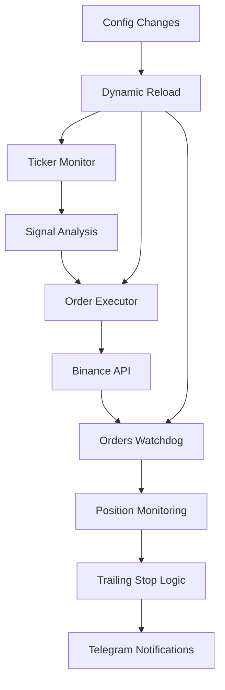

# PATRIOT Trading System - Developer Onboarding Guide

## 📋 Overview

PATRIOT is a sophisticated automated trading system for Binance Futures, designed to execute algorithmic trading strategies with advanced risk management, order monitoring, and dynamic configuration capabilities.

**Key Features:**
- Real-time ticker monitoring and signal processing
- Automated order execution with risk controls
- Advanced order lifecycle management (Watchdog)
- Dynamic configuration reloading
- Telegram notifications
- Trailing stop functionality (80/80/50)
- Comprehensive error handling and logging

---

## 🏗️ System Architecture

### Core Components

```
PATRIOT Trading System
├── 📊 Ticker Monitor (ticker_monitor.py)
│   ├── Signal Processing Pipeline
│   ├── Batch Processing Engine
│   └── Dynamic Config Reload
├── ⚡ Order Executor (order_executor.py)
│   ├── Risk Management
│   ├── Price Validation
│   └── Order Placement
├── 👁️ Orders Watchdog (orders_watchdog.py)
│   ├── Lifecycle Monitoring
│   ├── Trailing Stop Logic
│   └── Position Management
├── ⚙️ Configuration System
│   ├── config.py (Trading Parameters)
│   ├── env_loader.py (.env Management)
│   └── Dynamic Reload System
└── 🛠️ Utilities
    ├── manage_order.py (CLI Management)
    ├── ban_reporter.py (API Status)
    └── start_patriot.sh (Launcher)
```

### Data Flow Pipeline



---

## 🔄 Workflow & Pipelines

### 1. Main Processing Pipeline

#### Ticker Monitoring Cycle
```python
# ticker_monitor.py - Main Loop
def run(self):
    while True:
        # 1. Dynamic Config Reload (every batch)
        self._reload_configuration()

        # 2. Batch Processing
        self.process_tickers()

        # 3. Wait for next cycle
        time.sleep(self.batch_interval)
```

#### Batch Processing Details
```python
def process_tickers(self):
    logger.info("🟢 STARTING TICKER PROCESSING BATCH")

    for ticker in self.tickers:
        # Signal analysis for each ticker
        signals = self.analyzer.analyze_ticker(ticker)

        if signals:
            # Execute trading signals
            self.executor.execute_signals(signals)
```

### 2. Order Execution Pipeline

#### Signal to Order Flow
```python
# order_executor.py - Execution Flow
def execute_trading_signal(signal_data):
    # 1. Risk Assessment
    if not self._check_risk_limits(signal_data):
        return False

    # 2. Price Quality Validation
    if not self._check_price_quality(signal_data):
        return False

    # 3. Order Placement
    order_result = self._place_main_limit_order(signal_data)

    # 4. Watchdog Registration
    self._register_with_watchdog(order_result)

    # 5. Notifications
    self._send_success_notification(order_result)
```

### 3. Order Lifecycle Pipeline

#### Watchdog Monitoring
```python
# orders_watchdog.py - Monitoring Loop
async def monitor_orders(self):
    for order_id, watched_order in self.watched_orders.items():
        # 1. Status Check
        current_status = await self.api_client.get_order_status(order_id)

        # 2. State Update
        if current_status != watched_order.status:
            self._handle_status_change(watched_order, current_status)

        # 3. Trailing Logic
        if watched_order.status == 'FILLED':
            self._check_trailing_conditions(watched_order)

        # 4. Notifications
        self._send_relevant_notifications(watched_order)
```

---

## 📚 Key Classes & Functions

### Core Classes

#### 1. TickerMonitor ([`ticker_monitor.py`](ticker_monitor.py ))
```python
class TickerMonitor:
    def __init__(self):
        self.tickers = self.ticker_loader.load_tickers()
        self.executor = OrderExecutor()
        self.analyzer = SignalAnalyzer()
        self.batch_interval = 30  # seconds

    def run(self):
        """Main processing loop with dynamic config reload"""
        while True:
            self._reload_configuration()  # NEW: Dynamic reload
            self.process_tickers()
            time.sleep(self.batch_interval)

    def process_tickers(self):
        """Process all tickers in batch"""
        for ticker in self.tickers:
            signals = self.analyzer.analyze_ticker(ticker)
            if signals:
                self.executor.execute_signals(signals)

    def _reload_configuration(self):
        """Reload .env and config at batch start"""
        env_loader.reload_env_config()
        config.reload_trading_config()
```

#### 2. OrderExecutor ([`order_executor.py`](order_executor.py ))
```python
class OrderExecutor:
    def execute_trading_signal(self, signal_data: Dict[str, Any]) -> bool:
        """Main execution pipeline"""
        # Risk checks
        if not self._check_risk_limits(signal_data):
            return False

        # Price validation
        if not self._check_price_quality(signal_data):
            return False

        # Order placement
        order_result = self._place_main_limit_order(signal_data)

        # Registration
        self._register_with_watchdog(order_result)

        return True

    def _check_risk_limits(self, signal_data) -> bool:
        """Validate MAX_CONCURRENT_ORDERS and position limits"""
        # Implementation details...
        pass

    def _check_price_quality(self, signal_data) -> bool:
        """Validate order price vs existing orders"""
        # LONG: new price < best existing
        # SHORT: new price > best existing
        pass
```

#### 3. OrdersWatchdog ([`orders_watchdog.py`](orders_watchdog.py ))
```python
class OrdersWatchdog:
    def __init__(self):
        self.watched_orders = {}
        self.api_client = BinanceAPIClient()
        self.load_watched_orders()

    async def monitor_orders(self):
        """Continuous order monitoring"""
        for order_id, order in self.watched_orders.items():
            status = await self.api_client.get_order_status(order_id)
            if status != order.status:
                self._handle_status_change(order, status)

            if order.status == 'FILLED':
                self._check_trailing_conditions(order)

    def _check_trailing_conditions(self, order: WatchedOrder):
        """80/80/50 trailing logic"""
        if not order.trailing_triggered:
            progress = self._calculate_profit_progress(order)
            if progress >= 0.8:  # 80% to TP
                self._execute_trailing(order)
                order.trailing_triggered = True

    def _execute_trailing(self, order: WatchedOrder):
        """Close 80% position, move SL to 50% path"""
        # Close 80% of position
        # Move SL to entry ± 50% of TP path
        # Send notifications
        pass
```

#### 4. WatchedOrder (Data Structure)
```python
@dataclass
class WatchedOrder:
    order_id: str
    symbol: str
    side: str
    position_side: str
    quantity: Decimal
    price: Decimal
    order_type: str = 'LIMIT'
    status: str = 'NEW'
    created_at: datetime = field(default_factory=datetime.now)

    # Trading parameters
    signal_type: Optional[str] = None
    stop_loss: Optional[float] = None
    take_profit: Optional[float] = None

    # NEW: Trailing functionality
    trailing_triggered: bool = False

    # Position tracking
    position_size: Optional[Decimal] = None
    entry_price: Optional[Decimal] = None
    current_pnl: Optional[float] = None
```

### Configuration System

#### Config.py Structure
```python
# Environment variables (loaded once, reloadable)
BINANCE_API_KEY = os.getenv("BINANCE_MAINNET_API_KEY")
BINANCE_API_SECRET = os.getenv("BINANCE_MAINNET_API_SECRET")
BINANCE_TESTNET = os.getenv("BINANCE_TESTNET", "false").lower() == "true"

# Trading parameters (reloadable)
RISK_PERCENT = float(os.getenv("RISK_PERCENT", "2.0"))
FUTURES_LEVERAGE = int(os.getenv("FUTURES_LEVERAGE", "20"))
MAX_CONCURRENT_ORDERS = int(os.getenv("MAX_CONCURRENT_ORDERS", "3"))

# Telegram
TELEGRAM_BOT_TOKEN = os.getenv("TELEGRAM_BOT_TOKEN")
TELEGRAM_CHAT_ID = os.getenv("TELEGRAM_CHAT_ID")

def reload_trading_config():
    """Runtime config reload function"""
    global RISK_PERCENT, FUTURES_LEVERAGE, MAX_CONCURRENT_ORDERS
    # Reload all trading parameters from environment
    RISK_PERCENT = float(os.getenv("RISK_PERCENT", "2.0"))
    # ... etc
```

#### EnvLoader.py
```python
def load_env_file():
    """Load .env file once at startup"""
    env_path = Path('.env')
    if env_path.exists():
        load_dotenv(env_path)

def reload_env_config():
    """Reload .env file at runtime"""
    env_path = Path('.env')
    if env_path.exists():
        load_dotenv(env_path, override=True)
        logger.info("🔄 Environment variables reloaded from .env")
```

---

## ⚙️ Configuration & Setup

### Environment Variables (.env)
```env
# Binance API
BINANCE_TESTNET=false
BINANCE_MAINNET_API_KEY=your_mainnet_key
BINANCE_MAINNET_API_SECRET=your_mainnet_secret

# Trading Parameters
RISK_PERCENT=2.0
FUTURES_LEVERAGE=20
MAX_CONCURRENT_ORDERS=3

# Telegram
TELEGRAM_BOT_TOKEN=your_bot_token
TELEGRAM_CHAT_ID=your_chat_id

# System
LOG_LEVEL=INFO
```

### Tickers Configuration (tickers.txt)
```
BTCUSDT
ETHUSDT
BNBUSDT
ADAUSDT
SOLUSDT
```

### Dependencies (requirements.txt)
```
python-binance>=1.0.15
python-telegram-bot>=13.0
python-dotenv>=0.19.0
schedule>=1.1.0
asyncio
logging
pathlib
```

---

## 🚀 Launch & Monitoring

### Startup Sequence
```bash
# 1. Activate virtual environment
source /home/alexross/patriot/venv/bin/activate

# 2. Launch system
./start_patriot.sh

# Or manual launch:
python3 ticker_monitor.py &
python3 orders_watchdog.py &
```

### Key Processes
1. **Ticker Monitor** - Main processing engine
2. **Orders Watchdog** - Background order monitoring
3. **Telegram Bot** - Notification system

### Monitoring Commands
```bash
# Check running processes
ps aux | grep python

# View logs
tail -f logs/signals.log
tail -f logs/binance.log

# Check API ban status
python3 ban_reporter.py

# Manual order management
python3 manage_order.py BTCUSDT get-orders
python3 manage_order.py BTCUSDT STOP 45000
```

---

## 🔧 Implementation Features

### 1. Dynamic Configuration Reload
- **Trigger**: Every batch start in [`ticker_monitor.py`](ticker_monitor.py )
- **Scope**: All trading parameters + environment variables
- **Performance**: Minimal I/O impact (once per batch)
- **Safety**: Graceful error handling, fallback to defaults

### 2. Risk Management System
- **MAX_CONCURRENT_ORDERS**: Per-symbol limit on active positions + pending orders
- **Price Quality**: Ensures new orders improve position (better entry)
- **Position Sizing**: Risk-based calculation using RISK_PERCENT

### 3. Trailing Stop 80/80/50
- **Trigger**: 80% progress toward take profit
- **Action**: Close 80% of position (profit taking)
- **SL Adjustment**: Move stop loss to entry ± 50% of TP path
- **One-time**: Prevents repeated triggering

### 4. Order Lifecycle Management
- **States**: NEW → PARTIAL → FILLED → CANCELLED
- **Monitoring**: Continuous status polling via Binance API
- **Recovery**: Automatic SL/TP restoration on restart
- **Notifications**: Selective Telegram alerts (spam reduction)

### 5. Error Handling & Resilience
- **API Errors**: Exponential backoff retry logic
- **Network Issues**: Connection pooling and timeouts
- **Data Validation**: Comprehensive input sanitization
- **Logging**: Structured logging with multiple levels

### 6. Telegram Integration
- **Spam Reduction**: 60% fewer messages (commented non-critical)
- **Critical Events**: SL/TP execution, errors, external closures
- **Rich Formatting**: Emojis, structured messages
- **Async Delivery**: Non-blocking notification sending

---

## 🐛 Troubleshooting

### Common Issues

#### 1. Configuration Not Reloading
```python
# Check if reload functions are called
logger.info(f"RISK_PERCENT reloaded: {config.RISK_PERCENT}")

# Manual reload test
config.reload_trading_config()
env_loader.reload_env_config()
```

#### 2. Orders Not Executing
```python
# Check limits
python3 manage_order.py TICKER get-orders

# Verify API keys
python3 ban_reporter.py

# Check logs
grep "ERROR" logs/binance.log
```

#### 3. Telegram Not Working
```python
# Test bot token
curl "https://api.telegram.org/bot$TELEGRAM_BOT_TOKEN/getMe"

# Check chat ID
curl "https://api.telegram.org/bot$TELEGRAM_BOT_TOKEN/sendMessage?chat_id=$TELEGRAM_CHAT_ID&text=Test"
```

#### 4. Memory/Performance Issues
```python
# Monitor process
top -p $(pgrep -f ticker_monitor.py)

# Check watched orders count
wc -l orders_watchdog_state.json

# Restart components
pkill -f ticker_monitor.py
pkill -f orders_watchdog.py
```

### Debug Commands
```bash
# Full system status
./check_system_status.sh

# Test individual components
python3 -c "from config import *; print(f'API Key: {BINANCE_API_KEY[:10]}...')"
python3 -c "from ticker_loader import TickerLoader; print(TickerLoader().load_tickers())"
```

---

## 📈 Development Guidelines

### Code Style
- **PEP 8** compliance
- **Type hints** for all functions
- **Docstrings** for classes and methods
- **Logging** instead of print statements

### Testing
```python
# Unit tests structure
tests/
├── test_order_executor.py
├── test_orders_watchdog.py
├── test_config_reload.py
└── test_integration.py
```

### Adding New Features
1. **Minimal Changes**: Preserve existing architecture
2. **Backward Compatibility**: Don't break existing data structures
3. **Error Handling**: Comprehensive exception handling
4. **Logging**: Detailed logging for debugging
5. **Documentation**: Update this guide

### Performance Considerations
- **Batch Processing**: Minimize API calls per batch
- **Async Operations**: Use asyncio for I/O bound tasks
- **Memory Management**: Clean up completed orders
- **Rate Limiting**: Respect Binance API limits

---

This guide provides comprehensive coverage of the PATRIOT trading system. For specific implementation details, refer to the source code and inline documentation. Welcome to the team! 🚀
