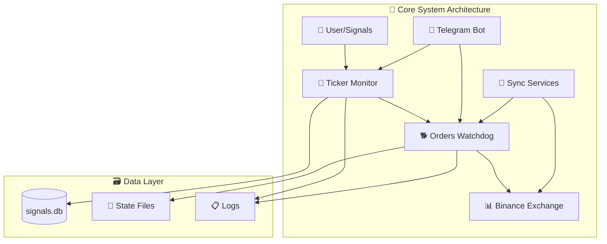
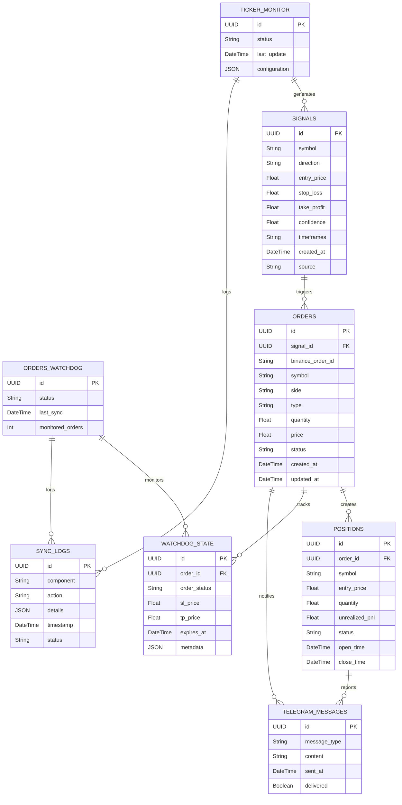

# 🚀 PATRIOT Trading System - Project Architecture Map

## 📋 Project Overview

**PATRIOT** is a sophisticated automated cryptocurrency trading system designed for signal-based trading on Binance futures markets. The system employs a dual-process architecture for reliability and independent operation.



---

## 🏗️ System Architecture

### 🎯 **Dual-Process Design**
- **Ticker Monitor** - Signal detection and order placement
- **Orders Watchdog** - Independent order execution monitoring
- **Independent Operation** - Each process can run separately

### 🔄 **Process Flow**
1. **Signal Detection** → Ticker Monitor analyzes market data
2. **Order Creation** → Generate trading orders from signals  
3. **Order Execution** → Orders Watchdog manages order lifecycle
4. **Position Monitoring** → Track SL/TP and position management
5. **Synchronization** → Keep system state consistent

---

## 📁 Core Components

### 🎼 **Main Processes**

| Component | File | Purpose |
|-----------|------|---------|
| **Ticker Monitor** | `ticker_monitor.py` | Signal detection & order generation |
| **Orders Watchdog** | `orders_watchdog.py` | Order execution & position monitoring |
| **Telegram Bot** | `telegram_bot.py` | Notifications & manual control |

### 🔧 **Core Services**

| Service | File | Purpose |
|---------|------|---------|
| **Order Executor** | `order_executor.py` | Order placement & execution logic |
| **Signal Analyzer** | `signal_analyzer.py` | Technical analysis & signal processing |
| **Sync Service** | `unified_sync.py` | State synchronization between components |
| **API Client** | `api_client.py` | Binance API interaction wrapper |

### 🗃️ **Data Management**

| Component | File | Purpose |
|-----------|------|---------|
| **Database** | `database.py` | SQLite signal storage |
| **Data Models** | `data_models.py` | Core data structures |
| **Symbol Cache** | `symbol_cache.py` | Trading pair information caching |

### ⚙️ **Configuration & Utils**

| Component | File | Purpose |
|-----------|------|---------|
| **Configuration** | `config.py` | System configuration & settings |
| **Environment** | `env_loader.py` | Environment variable management |
| **Utilities** | `utils.py` | Common helper functions |

---

## 🚀 Entry Points & Launchers

### 🖥️ **Primary Launchers**
```bash
# Windows
start_patriot.bat           # Windows batch launcher

# Linux/Unix  
start_patriot.sh            # Unix shell launcher
watchdog.sh                 # Orders Watchdog management
```

### 🔧 **Management Scripts**
```bash
./watchdog.sh start         # Start Orders Watchdog
./watchdog.sh stop          # Stop Orders Watchdog  
./watchdog.sh istop         # Interactive stop with order management
./watchdog.sh status        # Check system status
./watchdog.sh logs          # View real-time logs
```

---

## 🗂️ Project Structure

```
📁 production_bot/
├── 🎯 Core System
│   ├── ticker_monitor.py          # Main signal detection engine
│   ├── orders_watchdog.py         # Order monitoring service
│   ├── order_executor.py          # Order execution logic
│   ├── signal_analyzer.py         # Technical analysis engine
│   └── telegram_bot.py            # Telegram integration
│
├── 🔧 Services & APIs
│   ├── api_client.py              # Binance API wrapper
│   ├── unified_sync.py            # State synchronization
│   ├── order_sync_service.py      # Order sync between components
│   └── websocket_monitor.py       # Real-time data monitoring
│
├── 🗃️ Data & Storage
│   ├── database.py               # SQLite database manager
│   ├── data_models.py            # Data structure definitions
│   ├── symbol_cache.py           # Trading pair cache
│   └── signals.db               # Signal storage database
│
├── ⚙️ Configuration
│   ├── config.py                 # System configuration
│   ├── env_loader.py             # Environment management
│   ├── .env                      # Environment variables
│   └── requirements.txt          # Python dependencies
│
├── 🚀 Launchers & Scripts
│   ├── start_patriot.sh          # Unix launcher
│   ├── start_patriot.bat         # Windows launcher
│   ├── watchdog.sh               # Watchdog management
│   └── restart_patriot.sh        # System restart script
│
├── 📋 Data Files
│   ├── tickers.txt               # Trading pairs list
│   ├── symbol_filters.json       # Symbol filtering rules
│   ├── orders_watchdog_state.json # Watchdog state persistence
│   └── sync_log.json            # Synchronization logs
│
├── 📊 Logs & Monitoring
│   └── logs/
│       ├── orders_watchdog.log   # Watchdog operation logs
│       ├── signals.log           # Signal detection logs
│       └── order_sync.log        # Synchronization logs
│
└── 📚 Archive & Documentation
    ├── ARCHIVE/                  # Legacy components
    ├── INSTRUCTIONS/             # Setup & usage guides
    └── README.md                # Project documentation
```

---

## 🔄 Data Flow Architecture

```mermaid
sequenceDiagram
    participant TM as 🎼 Ticker Monitor
    participant DB as 🗃️ Database
    participant OW as 🐕 Orders Watchdog  
    participant EX as 📊 Exchange
    participant TG as 📱 Telegram
    
    TM->>DB: Store signals
    TM->>OW: Send order requests
    OW->>EX: Place orders
    EX->>OW: Order status updates
    OW->>TM: Execution confirmations
    OW->>TG: Status notifications
    
    Note over TM,OW: Unified Sync Service
    TM<->>OW: State synchronization
```

---

## 🛠️ Technology Stack

### 🐍 **Core Technologies**
- **Python 3.12+** - Primary development language
- **SQLite** - Signal and state storage
- **JSON** - Configuration and state files
- **Threading** - Concurrent operation management

### 📚 **Key Libraries**
- **python-binance** - Exchange API integration
- **python-telegram-bot** - Telegram notifications
- **logging** - Comprehensive system logging
- **pathlib** - Modern file path handling

### 🔧 **Development Tools**
- **Git** - Version control
- **Virtual Environment** - Dependency isolation
- **Shell Scripts** - Process management
- **Batch Files** - Windows compatibility

---

## 🔐 Security & Configuration

### 🔑 **API Key Management**
```env
# Production Environment
BINANCE_MAINNET_API_KEY=your_production_key
BINANCE_MAINNET_API_SECRET=your_production_secret

# Telegram Integration
TELEGRAM_BOT_TOKEN=your_bot_token
TELEGRAM_CHAT_ID=your_chat_id

# System Configuration
BINANCE_TESTNET=false
FUTURES_LEVERAGE=10
RISK_PER_TRADE=5.0
```

### 🛡️ **Security Features**
- Encrypted API key storage
- Environment-based configuration
- Secure credential management
- Process isolation

---

## 📊 Key Features

### 🎯 **Trading Capabilities**
- ✅ **Multi-timeframe analysis** (1H, 4H, 1D)
- ✅ **Automated signal detection**
- ✅ **Risk management** (Stop Loss / Take Profit)
- ✅ **Position sizing** based on risk percentage
- ✅ **Real-time order monitoring**

### 🔄 **System Management**
- ✅ **Independent process architecture**
- ✅ **Graceful shutdown** with order preservation
- ✅ **State persistence** across restarts
- ✅ **Automatic synchronization**
- ✅ **Comprehensive logging**

### 📱 **Monitoring & Notifications**
- ✅ **Telegram integration** for real-time alerts
- ✅ **Order execution notifications**
- ✅ **Position status updates**
- ✅ **System health monitoring**
- ✅ **Error reporting**

### 🛠️ **Development Features**
- ✅ **Modular architecture** for easy maintenance
- ✅ **Comprehensive error handling**
- ✅ **Debug and production modes**
- ✅ **Extensible plugin system**
- ✅ **Version synchronization**

---

## 🎮 Usage Examples

### 🚀 **Starting the System**
```bash
# Start complete system
./start_patriot.sh

# Start individual components
./watchdog.sh start         # Start Orders Watchdog
python ticker_monitor.py   # Start Ticker Monitor
```

### 🛑 **Stopping the System**
```bash
# Standard stop
./watchdog.sh stop

# Interactive stop with order management
./watchdog.sh istop

# Emergency stop
pkill -f "ticker_monitor.py"
pkill -f "orders_watchdog.py"
```

### 📊 **Monitoring**
```bash
# Check system status
./watchdog.sh status

# View real-time logs
./watchdog.sh logs
tail -f logs/orders_watchdog.log

# Check synchronization
python sync_check.py --report
```

---

## 🎯 Future Development

### 🔮 **Planned Enhancements**
- **Multi-exchange support** (beyond Binance)
- **Advanced ML-based signals**
- **Portfolio management features**
- **Web-based dashboard**
- **Mobile app integration**

### 🏗️ **Architecture Evolution**
- **Microservices migration**
- **Container deployment**
- **Cloud-native scaling**
- **Real-time streaming architecture**

---

## 🗃️ Database Schema



---

*This map represents the current state of the PATRIOT trading system as of August 2025. The system is actively developed and maintained with regular updates and improvements.*
