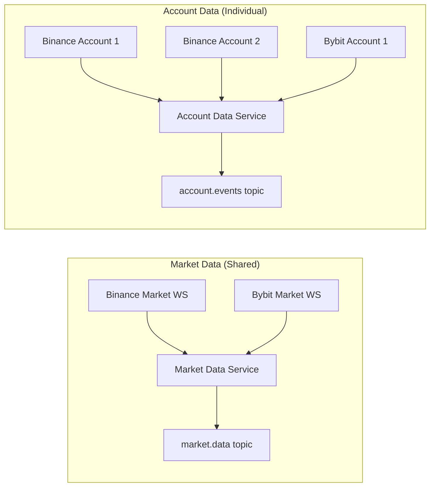
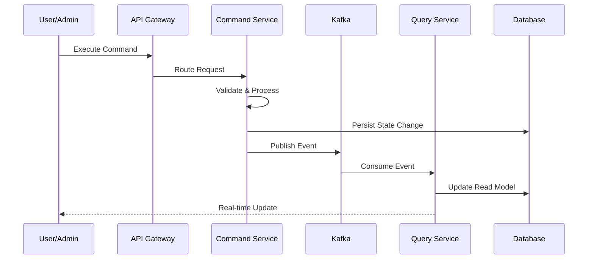
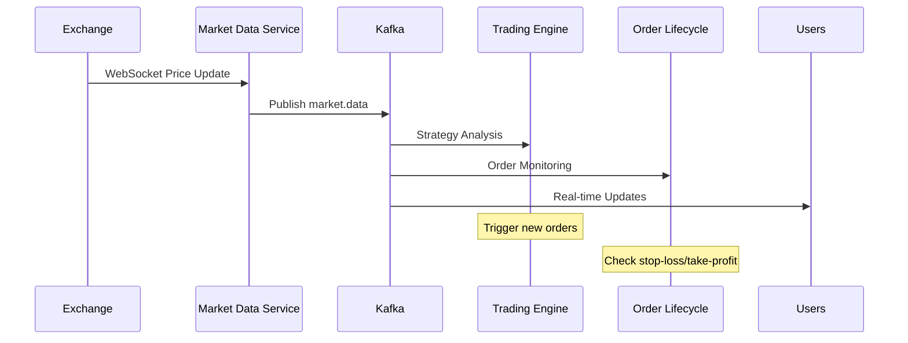
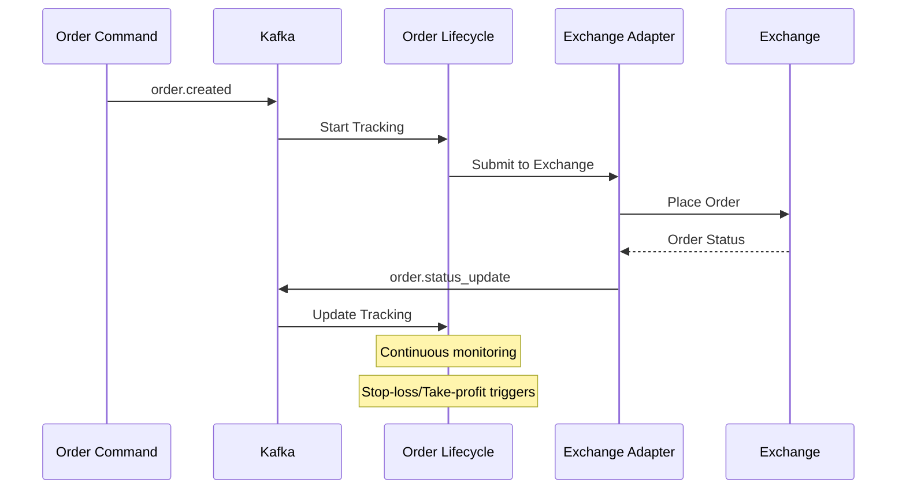
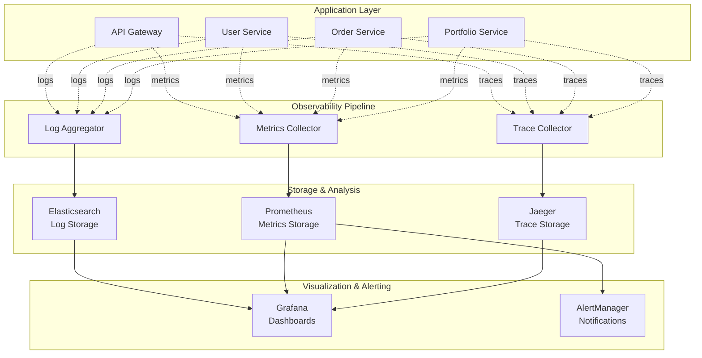
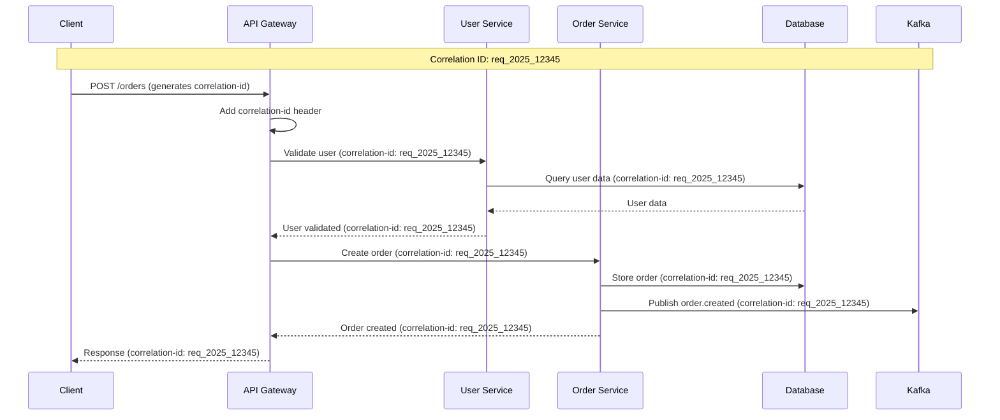
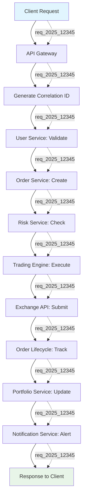

# PATRIOT Trading System - System Architecture Design

## 📋 Document Information

**Document ID**: 02-SYSTEM-ARCHITECTURE  
**Version**: 2.0  
**Date**: September 2025  
**Authors**: Solution Architecture Team  
**Status**: Draft  

> **Cross-References:**  
> - System Requirements: [01-SYSTEM-REQUIREMENTS.md](01-SYSTEM-REQUIREMENTS.md)  
> - Component Specifications: [03-COMPONENT-SPECIFICATIONS.md](03-COMPONENT-SPECIFICATIONS.md)  
> - Infrastructure Details: [04-INFRASTRUCTURE.md](04-INFRASTRUCTURE.md)  
> - Database Design: [annexes/ANNEX-B-DATABASE-DESIGN.md](annexes/ANNEX-B-DATABASE-DESIGN.md)

---

## 🏛️ Architectural Overview

### System Vision
The PATRIOT trading system implements a **production-ready multi-user hedge fund platform** capable of managing 100+ concurrent users across multiple cryptocurrency exchanges. The architecture transitions from a single-user MVP to a scalable, maintainable, and robust solution following industry best practices.

### Core Architectural Principles

#### 1. **CQRS (Command Query Responsibility Segregation)**
Separates read and write operations for optimal scalability and performance:
- **Command Side**: Handles write operations, business logic, and state changes
- **Query Side**: Optimized for read operations with dedicated read models  
- **Event Bridge**: Kafka event streaming connects command and query sides
- **Independent Scaling**: Read and write sides scale independently based on demand

#### 2. **Event-Driven Architecture**  
All system components communicate through well-defined events:
- **Loose Coupling**: Services interact only through event contracts
- **Scalability**: Horizontal scaling through event partitioning
- **Reliability**: Event replay capabilities for system recovery
- **Audit Trail**: Natural audit logging through event persistence

#### 3. **Microservices Design**
Domain-driven service boundaries with clear responsibilities:
- **Domain Alignment**: Services aligned with business domains (User, Trading, Risk)
- **Independent Deployment**: Services deployed and scaled independently
- **Technology Diversity**: Different services can use optimal technologies
- **Failure Isolation**: Service failures don't cascade across the system

#### 4. **Multi-Layer Security**
Comprehensive security model with multiple protection layers:
- **Network Isolation**: Only API Gateway exposed externally
- **Service Authentication**: Internal service tokens for production
- **Data Encryption**: AES-256 for sensitive data and API credentials
- **Access Control**: JWT-based authentication with RBAC

#### 5. **Distributed Observability**
Comprehensive logging, monitoring, and tracing across all system components:
- **Structured Logging**: JSON-formatted logs with consistent metadata
- **Distributed Tracing**: Request correlation across all microservices
- **Real-time Metrics**: Application and business metrics collection
- **Centralized Monitoring**: Unified dashboards and alerting system

#### 6. **Request Correlation & Tracing**
Every business operation tracked across the entire system:
- **Correlation ID**: Unique identifier for each business transaction
- **Trace Propagation**: Request IDs flow through all service calls
- **Contextual Logging**: Every log entry includes request correlation data
- **End-to-End Visibility**: Complete audit trail for debugging and compliance

---

## 🏗️ High-Level System Architecture

### System Architecture Diagram

```mermaid
graph TB
    subgraph "External Interfaces"
        TG[Telegram Bot Gateway]
        ADMIN[Admin Web Dashboard]
        EXCH[Exchange APIs<br/>Binance/Bybit]
        MON[External Monitoring]
    end
    
    subgraph "API Gateway Layer"
        KONG[Kong API Gateway<br/>Port 8000]
        AUTH[Authentication Service]
        RATE[Rate Limiter]
    end
    
    subgraph "Command Services (CQRS Write)"
        UC[User Command Service]
        AC[Account Command Service] 
        OC[Order Command Service]
        SC[Strategy Command Service]
    end
    
    subgraph "Query Services (CQRS Read)"
        UQ[User Query Service]
        PQ[Portfolio Query Service]
        RQ[Risk Query Service]
        AQ[Analytics Query Service]
    end
    
    subgraph "Domain Services"
        TE[Trading Engine]
        RE[Risk Engine]
        SE[Strategy Engine]
        OLS[Order Lifecycle Service]
    end
    
    subgraph "Data Services"
        MDS[Market Data Service]
        ADS[Account Data Service]
        EA[Exchange Adapters]
    end
    
    subgraph "Event Streaming"
        KAFKA[Kafka Event Bus<br/>Topics: market.data, order.events, account.events]
    end
    
    subgraph "Data Storage"
        PG[PostgreSQL<br/>Primary Database]
        TSDB[TimescaleDB<br/>Time-Series Extension]
        REDIS[Redis<br/>Cache & Sessions]
        ES[Event Store<br/>Audit Trail]
    end
    
    subgraph "Observability & Monitoring"
        PROM[Prometheus<br/>Metrics Collection]
        GRAF[Grafana<br/>Dashboards & Alerts]
        JAEGER[Jaeger<br/>Distributed Tracing]
        ELK[ELK Stack<br/>Centralized Logging]
        ALERT[AlertManager<br/>Incident Response]
    end
    
    subgraph "Infrastructure"
        LB[Load Balancer]
        CONSUL[Consul<br/>Service Discovery]
        VAULT[HashiCorp Vault<br/>Secrets Management]
    end
    
    %% External connections
    TG --> KONG
    ADMIN --> KONG
    MON --> PROM
    
    %% API Gateway routing
    KONG --> AUTH
    KONG --> UC
    KONG --> UQ
    KONG --> RATE
    
    %% Command flow
    UC --> KAFKA
    AC --> KAFKA  
    OC --> KAFKA
    SC --> KAFKA
    
    %% Query data sources
    UQ --> PG
    PQ --> REDIS
    PQ --> TSDB
    RQ --> PG
    AQ --> TSDB
    
    %% Event consumption
    KAFKA --> UQ
    KAFKA --> PQ
    KAFKA --> RQ
    KAFKA --> AQ
    KAFKA --> TE
    KAFKA --> RE
    KAFKA --> OLS
    
    %% Domain service interactions
    TE --> EA
    OLS --> EA
    EA --> EXCH
    
    %% Data services
    MDS --> KAFKA
    ADS --> KAFKA
    MDS --> EXCH
    ADS --> EXCH
    
    %% Storage connections
    UC --> PG
    AC --> PG
    OC --> PG
    SC --> PG
    KAFKA --> ES
    
    %% Observability connections
    UC -.->|metrics| PROM
    AC -.->|metrics| PROM
    OC -.->|metrics| PROM
    UQ -.->|metrics| PROM
    PQ -.->|metrics| PROM
    TE -.->|metrics| PROM
    RE -.->|metrics| PROM
    
    UC -.->|logs| ELK
    AC -.->|logs| ELK
    OC -.->|logs| ELK
    UQ -.->|logs| ELK
    PQ -.->|logs| ELK
    TE -.->|logs| ELK
    RE -.->|logs| ELK
    KONG -.->|logs| ELK
    
    UC -.->|traces| JAEGER
    AC -.->|traces| JAEGER
    OC -.->|traces| JAEGER
    UQ -.->|traces| JAEGER
    PQ -.->|traces| JAEGER
    TE -.->|traces| JAEGER
    RE -.->|traces| JAEGER
    
    PROM --> GRAF
    PROM --> ALERT
    ELK --> GRAF
    JAEGER --> GRAF
    
    %% Monitoring
    UC -.-> PROM
    OC -.-> PROM
    TE -.-> PROM
    PG -.-> PROM
    REDIS -.-> PROM
```



### Architectural Layers

#### **Layer 1: External Interface Layer**
**Purpose**: External system interactions and user interfaces  
**Components**: 
- **Telegram Bot Gateway**: Primary user interface for account management and notifications
- **Admin Web Dashboard**: Administrative interface for system management and monitoring  
- **Exchange APIs**: External cryptocurrency exchange integrations (Binance, Bybit)

**Design Principles**:
- All external traffic routed through API Gateway
- No direct service exposure to external networks
- Standardized authentication and authorization

#### **Layer 2: API Gateway Layer**  
**Purpose**: Request routing, security, and traffic management  
**Components**:
- **Kong API Gateway**: Central routing and load balancing (Port 8000)
- **Authentication Service**: JWT token validation and user session management
- **Rate Limiter**: Request throttling and abuse prevention

**Security Model**:
```
External Request → Kong Gateway → Authentication → Internal Service
                 ↓
         Rate Limiting & Request Validation
```

#### **Layer 3: Application Service Layer (CQRS)**
**Purpose**: Business logic execution with separated read/write operations

**Command Services (Write Operations)**:
- **User Command Service**: User registration, profile management, account linking
- **Account Command Service**: Exchange account management and API credential handling
- **Order Command Service**: Order creation, modification, cancellation, and validation
- **Strategy Command Service**: Strategy deployment and user assignment management

**Query Services (Read Operations)**:
- **User Query Service**: User profile and account information retrieval
- **Portfolio Query Service**: Real-time portfolio and position data
- **Risk Query Service**: Risk metrics and compliance status
- **Analytics Query Service**: Performance analytics and reporting

**Event Flow Pattern**:
```
Command Service → Validates → Executes → Publishes Event → Query Service Updates Read Model
```

#### **Layer 4: Domain Service Layer**
**Purpose**: Core business logic implementation and domain rule enforcement

**Trading Domain Services**:
- **Trading Engine**: Core trading logic, order execution strategies, and market analysis
- **Order Lifecycle Service**: Comprehensive order tracking, stop-loss/take-profit management
- **Exchange Adapters**: Exchange-specific API integrations with unified interfaces

**Risk Management Services**:
- **Risk Engine**: Real-time risk assessment, VaR calculations, margin monitoring
- **Strategy Engine**: Strategy execution, parameter management, performance tracking

**Service Interaction Pattern**:
```
Domain Service ↔ Kafka Events ↔ External APIs
       ↓
   Business Rules & Domain Logic
       ↓
   Event Publication
```

#### **Layer 5: Data Service Layer**
**Purpose**: External data integration and real-time data management

**Market Data Services**:
- **Market Data Service**: Shared WebSocket connections for market data (1 per exchange/symbol)
- **Account Data Service**: Individual WebSocket connections for private account data

**Data Flow Optimization**:


#### **Layer 6: Infrastructure Layer**
**Purpose**: Data persistence, event streaming, and system observability

**Data Storage**:
- **PostgreSQL**: Primary transactional database with ACID compliance
- **TimescaleDB**: Time-series extension for performance and historical data
- **Redis**: High-performance caching and session storage
- **Event Store**: Immutable audit trail for event sourcing

**Event Streaming**:
- **Kafka**: Central event bus with topic-based message routing
- **Topic Strategy**: Domain-based topics (market.data, order.events, account.events)

---

## 🔄 Data Flow Architecture

### Event-Driven Data Flow

The system implements a comprehensive event-driven architecture where all state changes flow through Kafka topics, ensuring consistency, auditability, and scalability.

#### Primary Event Flow Patterns

**1. Command Processing Flow**


**2. Market Data Processing Flow**


**3. Order Lifecycle Management**


### Kafka Topic Architecture

#### Core Topics Design

**Market Data Topics**:
- `market.data.prices` - Real-time price updates (high volume)
- `market.data.orderbook` - Order book snapshots (medium volume)  
- `market.data.trades` - Trade execution data (high volume)

**Order Management Topics**:
- `order.commands` - Order creation/modification commands
- `order.events` - Order lifecycle events (created, filled, cancelled)
- `order.status` - Real-time order status updates

**Account Management Topics**:
- `account.events` - Account state changes (balance, positions)
- `user.events` - User profile and authentication events
- `strategy.events` - Strategy assignment and performance events

**Risk Management Topics**:
- `risk.alerts` - Risk threshold violations and alerts
- `risk.metrics` - Periodic risk metric calculations
- `compliance.events` - Regulatory and compliance events

#### Topic Partitioning Strategy

**User-Based Partitioning**:
```python
# Account events partitioned by user_id for ordered processing
partition_key = user_id % partition_count

# Market data partitioned by symbol for parallel processing  
partition_key = hash(symbol) % partition_count
```

**Benefits**:
- **Ordered Processing**: User-specific events processed in sequence
- **Scalability**: Parallel processing across partitions
- **Fault Tolerance**: Partition isolation prevents cross-user impact

---

## 🏗️ Component Integration Patterns

### WebSocket Management Architecture

#### Problem Solved: Market Data Duplication
Traditional approach would create individual WebSocket connections per user, leading to:
- Excessive API rate limit consumption
- Duplicated network bandwidth usage
- Increased latency and connection management overhead

#### Solution: Dual WebSocket Architecture

**Market Data Service (Shared Connections)**:
```python
class MarketDataService:
    """
    Shared WebSocket connections for market data
    One connection per exchange per symbol
    """
    connections: Dict[str, WebSocket] = {}  # "binance:BTCUSDT" -> WebSocket
    subscriptions: Dict[str, int] = {}      # symbol -> subscriber_count
    
    async def subscribe_symbol(self, exchange: str, symbol: str):
        """Subscribe to symbol data with connection sharing"""
        key = f"{exchange}:{symbol}"
        
        if key not in self.connections:
            # Create new shared connection
            self.connections[key] = await create_websocket(exchange, symbol)
            self.subscriptions[key] = 0
            
        self.subscriptions[key] += 1
        return self.connections[key]
```

**Account Data Service (Individual Connections)**:
```python
class AccountDataService:
    """
    Individual WebSocket connections for private account data
    One connection per user account per exchange
    """
    account_connections: Dict[str, WebSocket] = {}  # account_id -> WebSocket
    
    async def connect_account(self, user_id: str, exchange: str, api_credentials):
        """Create dedicated connection for account data"""
        connection_key = f"{user_id}:{exchange}"
        
        if connection_key not in self.account_connections:
            ws = await create_authenticated_websocket(exchange, api_credentials)
            self.account_connections[connection_key] = ws
            
        return self.account_connections[connection_key]
```

### Order Lifecycle Management

#### Automated Order Discovery
Orders are automatically tracked through Kafka event consumption rather than manual registration:

```python
class OrderLifecycleService:
    """
    Automatically tracks all orders through event consumption
    No manual registration required
    """
    
    async def handle_order_created(self, event: OrderCreatedEvent):
        """Automatically start tracking new order"""
        order_tracker = OrderTracker(
            order_id=event.order_id,
            symbol=event.symbol,
            strategy_params=event.strategy_params
        )
        
        # Start monitoring market data for triggers
        await self.start_monitoring(order_tracker)
        
        # Register for market updates
        await self.market_data_service.subscribe(event.symbol)
    
    async def handle_market_update(self, price_update: MarketDataEvent):
        """Check all tracked orders for trigger conditions"""
        for order_tracker in self.active_orders:
            if order_tracker.symbol == price_update.symbol:
                await self.check_triggers(order_tracker, price_update.price)
```

#### Strategy Logic Implementation
```python
class OrderTracker:
    """
    Implements trailing stop-loss and take-profit logic
    """
    
    async def check_triggers(self, current_price: float):
        """Check stop-loss and take-profit conditions"""
        
        # Trailing stop-loss (80/80/50 pattern)
        if self.strategy_type == "trailing_stop":
            if current_price > self.entry_price * 1.80:  # 80% profit
                self.stop_loss = self.entry_price * 1.80
            elif current_price > self.entry_price * 1.50:  # 50% profit
                self.stop_loss = max(self.stop_loss, self.entry_price * 1.50)
                
        # Execute stop-loss if triggered
        if current_price <= self.stop_loss:
            await self.execute_stop_loss()
            
        # Execute take-profit if triggered  
        if current_price >= self.take_profit:
            await self.execute_take_profit()
```

---

## 💾 Data Architecture Strategy

### Database Architecture Decision: PostgreSQL + TimescaleDB

#### Technology Choice Rationale

**Selected**: PostgreSQL with TimescaleDB extension  
**Alternatives Considered**: InfluxDB, MongoDB + InfluxDB, Separate OLTP/OLAP systems

**Decision Matrix**:

| Criteria | PostgreSQL+TimescaleDB | InfluxDB | MongoDB+InfluxDB |
|----------|------------------------|----------|------------------|
| **ACID Transactions** | ✅ Full ACID compliance | ❌ Limited transactions | ⚠️ Complex coordination |
| **SQL Interface** | ✅ Standard SQL | ❌ Custom query language | ⚠️ Multiple query languages |
| **Relational Joins** | ✅ Full JOIN support | ❌ No relational joins | ⚠️ Application-level joins |
| **Time-Series Performance** | ✅ Optimized with extension | ✅ Native optimization | ✅ InfluxDB component |
| **Operational Complexity** | ✅ Single database stack | ✅ Single purpose-built | ❌ Multiple database management |
| **Financial Data Integrity** | ✅ Perfect for financial data | ⚠️ Eventual consistency | ⚠️ Cross-system consistency |

#### Database Schema Design

**OLTP Tables (Transactional Data)**:
```sql
-- User management
CREATE TABLE users (
    id UUID PRIMARY KEY DEFAULT gen_random_uuid(),
    telegram_id BIGINT UNIQUE NOT NULL,
    username VARCHAR(255),
    created_at TIMESTAMPTZ DEFAULT NOW(),
    status user_status_enum DEFAULT 'active'
);

-- Exchange accounts  
CREATE TABLE user_accounts (
    id UUID PRIMARY KEY DEFAULT gen_random_uuid(),
    user_id UUID REFERENCES users(id),
    exchange exchange_enum NOT NULL,
    api_key_encrypted TEXT NOT NULL,
    api_secret_encrypted TEXT NOT NULL,
    is_active BOOLEAN DEFAULT true,
    created_at TIMESTAMPTZ DEFAULT NOW()
);

-- Orders
CREATE TABLE orders (
    id UUID PRIMARY KEY DEFAULT gen_random_uuid(),
    user_account_id UUID REFERENCES user_accounts(id),
    exchange_order_id VARCHAR(255),
    symbol VARCHAR(50) NOT NULL,
    side order_side_enum NOT NULL,
    type order_type_enum NOT NULL,
    quantity DECIMAL(18,8) NOT NULL,
    price DECIMAL(18,8),
    status order_status_enum DEFAULT 'pending',
    created_at TIMESTAMPTZ DEFAULT NOW(),
    updated_at TIMESTAMPTZ DEFAULT NOW()
);
```

**Time-Series Tables (TimescaleDB Hypertables)**:
```sql
-- Portfolio snapshots (high frequency)
CREATE TABLE portfolio_snapshots (
    time TIMESTAMPTZ NOT NULL,
    user_account_id UUID NOT NULL,
    symbol VARCHAR(50),
    quantity DECIMAL(18,8),
    value_usd DECIMAL(18,2),
    unrealized_pnl DECIMAL(18,2)
);

-- Convert to hypertable for time-series optimization
SELECT create_hypertable('portfolio_snapshots', 'time', 'user_account_id', 4);

-- Performance metrics (daily aggregation)
CREATE TABLE performance_metrics (
    time TIMESTAMPTZ NOT NULL,
    user_id UUID NOT NULL,
    total_balance_usd DECIMAL(18,2),
    daily_pnl DECIMAL(18,2),
    total_pnl DECIMAL(18,2),
    sharpe_ratio DECIMAL(10,4),
    max_drawdown DECIMAL(10,4)
);

SELECT create_hypertable('performance_metrics', 'time', 'user_id', 2);
```

#### Event Store Implementation
```sql
-- Event sourcing for complete audit trail
CREATE TABLE event_store (
    id UUID PRIMARY KEY DEFAULT gen_random_uuid(),
    aggregate_id UUID NOT NULL,
    aggregate_type VARCHAR(100) NOT NULL,
    event_type VARCHAR(100) NOT NULL,
    event_data JSONB NOT NULL,
    event_version INTEGER NOT NULL,
    occurred_at TIMESTAMPTZ DEFAULT NOW(),
    
    -- Ensure event ordering
    UNIQUE(aggregate_id, event_version)
);

-- Optimize for event replay queries
CREATE INDEX idx_event_store_aggregate ON event_store(aggregate_id, event_version);
CREATE INDEX idx_event_store_type ON event_store(aggregate_type, occurred_at);
```

### Caching Strategy with Redis

#### Multi-Level Caching Architecture

**Level 1: Application Cache (Redis)**
```python
class CachingStrategy:
    """
    Multi-level caching with TTL management
    """
    
    # Session data (short TTL)
    USER_SESSIONS = "user:session:{user_id}"  # TTL: 1 hour
    
    # Portfolio data (medium TTL) 
    PORTFOLIO_DATA = "portfolio:{user_id}"    # TTL: 30 seconds
    
    # Market data (very short TTL)
    MARKET_PRICES = "price:{symbol}"          # TTL: 5 seconds
    
    # Strategy results (long TTL)
    STRATEGY_RESULTS = "strategy:{id}:results"  # TTL: 5 minutes
```

**Level 2: Query Result Caching**
```python
async def get_portfolio_summary(user_id: str) -> PortfolioSummary:
    """
    Cached portfolio summary with intelligent invalidation
    """
    cache_key = f"portfolio:summary:{user_id}"
    
    # Try cache first
    cached_result = await redis.get(cache_key)
    if cached_result:
        return PortfolioSummary.parse_raw(cached_result)
    
    # Generate from database
    summary = await calculate_portfolio_summary(user_id)
    
    # Cache with conditional TTL based on market hours
    ttl = 30 if market_is_open() else 300  # 30s vs 5min
    await redis.setex(cache_key, ttl, summary.json())
    
    return summary
```

---

## 🔒 Security Architecture

### Multi-Layer Security Model

#### Layer 1: Network Security
```yaml
# Kong API Gateway Configuration
services:
  kong:
    ports:
      - "8000:8000"  # Only external port exposed
    environment:
      - KONG_DATABASE=off
      - KONG_DECLARATIVE_CONFIG=/config/kong.yml
      
  # Internal services - no external exposure
  user-command-service:
    ports:
      - "8001"  # Internal only
    networks:
      - internal
      
  order-command-service:
    ports:
      - "8002"  # Internal only
    networks:
      - internal
```

#### Layer 2: Service Authentication
```python
class ServiceAuthenticationMiddleware:
    """
    Internal service-to-service authentication
    """
    
    def __init__(self, service_name: str, secret_key: str):
        self.service_name = service_name
        self.secret_key = secret_key
    
    async def authenticate_request(self, request):
        """Validate internal service tokens"""
        service_token = request.headers.get("X-Service-Token")
        
        if not service_token:
            raise UnauthorizedError("Missing service token")
            
        try:
            payload = jwt.decode(service_token, self.secret_key, algorithms=["HS256"])
            return payload["service_name"]
        except jwt.InvalidTokenError:
            raise UnauthorizedError("Invalid service token")
```

#### Layer 3: Data Encryption
```python
class APIKeyEncryption:
    """
    AES-256 encryption for exchange API credentials
    """
    
    def __init__(self, master_key: bytes):
        self.cipher_suite = Fernet(master_key)
    
    async def encrypt_api_key(self, api_key: str) -> str:
        """Encrypt API key for storage"""
        encrypted_key = self.cipher_suite.encrypt(api_key.encode())
        return base64.b64encode(encrypted_key).decode()
    
    async def decrypt_api_key(self, encrypted_key: str) -> str:
        """Decrypt API key for use"""
        encrypted_bytes = base64.b64decode(encrypted_key.encode())
        decrypted_key = self.cipher_suite.decrypt(encrypted_bytes)
        return decrypted_key.decode()
```

#### Layer 4: Access Control
```python
class RoleBasedAccessControl:
    """
    JWT-based authentication with role permissions
    """
    
    ROLE_PERMISSIONS = {
        "user": ["portfolio:read", "orders:create", "orders:read"],
        "admin": ["users:manage", "strategies:manage", "system:monitor"],
        "fund_manager": ["analytics:read", "risk:manage", "reports:generate"]
    }
    
    async def check_permission(self, token: str, required_permission: str) -> bool:
        """Validate user permissions for requested action"""
        try:
            payload = jwt.decode(token, self.jwt_secret, algorithms=["HS256"])
            user_role = payload.get("role")
            
            allowed_permissions = self.ROLE_PERMISSIONS.get(user_role, [])
            return required_permission in allowed_permissions
            
        except jwt.InvalidTokenError:
            return False
```

---

## 📊 Scalability and Performance Design

### Horizontal Scaling Strategy

#### Stateless Service Design
```python
class StatelessServicePattern:
    """
    All services designed as stateless for horizontal scaling
    """
    
    def __init__(self, config: ServiceConfig):
        # No local state storage
        self.db_pool = create_connection_pool(config.database_url)
        self.redis_client = create_redis_client(config.redis_url)
        self.kafka_producer = create_kafka_producer(config.kafka_brokers)
    
    async def handle_request(self, request):
        """Process request without maintaining local state"""
        # All state retrieved from external stores
        user_context = await self.redis_client.get(f"user:{request.user_id}")
        
        # Process business logic
        result = await self.process_business_logic(request, user_context)
        
        # Persist results externally
        await self.db_pool.execute(update_query, result.data)
        await self.kafka_producer.send("events", result.event)
        
        return result
```

#### Load Balancing Configuration
```yaml
# Kong upstream configuration for service scaling
upstreams:
  - name: user-command-service
    targets:
      - target: user-command-service-1:8001
        weight: 100
      - target: user-command-service-2:8001  
        weight: 100
    healthchecks:
      active:
        healthy:
          interval: 30
          http_statuses: [200, 201]
```

### Performance Optimization Patterns

#### Database Query Optimization
```sql
-- Optimized queries with proper indexing
CREATE INDEX CONCURRENTLY idx_orders_user_status 
ON orders(user_account_id, status, created_at DESC)
WHERE status IN ('pending', 'partially_filled');

-- Partition tables by time for historical data
CREATE TABLE portfolio_snapshots_2024_01 
PARTITION OF portfolio_snapshots
FOR VALUES FROM ('2024-01-01') TO ('2024-02-01');
```

#### Connection Pool Management
```python
class DatabaseConnectionPool:
    """
    Optimized connection pooling for high concurrency
    """
    
    def __init__(self):
        self.pool = asyncpg.create_pool(
            min_size=10,        # Minimum connections
            max_size=20,        # Maximum connections  
            max_queries=50000,  # Rotate connections
            max_inactive_connection_lifetime=300.0,  # 5 minutes
            command_timeout=60  # Query timeout
        )
```

---

## 📊 Observability & Request Tracing Architecture

### Distributed Observability Stack

#### Core Components


### Request Correlation & Tracing

#### Correlation ID Flow
Every business operation receives a unique correlation ID that flows through all services:



#### Implementation Patterns

**1. Correlation ID Generation**
```python
import uuid
from datetime import datetime

class CorrelationIDManager:
    @staticmethod
    def generate_correlation_id() -> str:
        """Generate unique correlation ID"""
        timestamp = int(datetime.now().timestamp() * 1000)
        unique_suffix = str(uuid.uuid4())[:8]
        return f"req_{timestamp}_{unique_suffix}"
    
    @staticmethod
    def extract_correlation_id(request) -> str:
        """Extract or generate correlation ID from request"""
        correlation_id = request.headers.get('X-Correlation-ID')
        if not correlation_id:
            correlation_id = CorrelationIDManager.generate_correlation_id()
        return correlation_id
```

**2. Request Context Propagation**
```python
from contextvars import ContextVar

# Context variable to store correlation ID
correlation_id_var: ContextVar[str] = ContextVar('correlation_id')

class RequestContext:
    @staticmethod
    def set_correlation_id(correlation_id: str):
        """Set correlation ID in current context"""
        correlation_id_var.set(correlation_id)
    
    @staticmethod
    def get_correlation_id() -> str:
        """Get correlation ID from current context"""
        return correlation_id_var.get("")
    
    @staticmethod
    def propagate_to_headers(headers: dict) -> dict:
        """Add correlation ID to outgoing request headers"""
        correlation_id = RequestContext.get_correlation_id()
        if correlation_id:
            headers['X-Correlation-ID'] = correlation_id
            headers['X-Trace-ID'] = correlation_id
        return headers
```

**3. Structured Logging with Context**
```python
import logging
import json
from datetime import datetime

class ContextualLogger:
    def __init__(self, service_name: str):
        self.service_name = service_name
        self.logger = logging.getLogger(service_name)
        
    def log(self, level: str, message: str, **kwargs):
        """Log with full contextual information"""
        correlation_id = RequestContext.get_correlation_id()
        
        log_entry = {
            "timestamp": datetime.utcnow().isoformat(),
            "level": level.upper(),
            "service": self.service_name,
            "correlation_id": correlation_id,
            "message": message,
            "context": kwargs
        }
        
        self.logger.info(json.dumps(log_entry))
    
    def info(self, message: str, **kwargs):
        self.log("info", message, **kwargs)
    
    def error(self, message: str, **kwargs):
        self.log("error", message, **kwargs)

# Usage example
logger = ContextualLogger("user-command-service")
logger.info("User order created", 
           user_id="12345", 
           order_id="ord_67890", 
           symbol="BTCUSDT")
```

**4. Distributed Tracing Integration**
```python
from opentelemetry import trace
from opentelemetry.exporter.jaeger.thrift import JaegerExporter
from opentelemetry.sdk.trace import TracerProvider
from opentelemetry.sdk.trace.export import BatchSpanProcessor

class DistributedTracing:
    def __init__(self, service_name: str):
        # Configure Jaeger exporter
        jaeger_exporter = JaegerExporter(
            agent_host_name="jaeger-agent",
            agent_port=6831,
        )
        
        # Set up tracer
        trace.set_tracer_provider(TracerProvider())
        tracer = trace.get_tracer_provider()
        tracer.add_span_processor(
            BatchSpanProcessor(jaeger_exporter)
        )
        
        self.tracer = trace.get_tracer(service_name)
    
    def start_span(self, operation_name: str):
        """Start a new span with correlation context"""
        correlation_id = RequestContext.get_correlation_id()
        
        span = self.tracer.start_span(operation_name)
        span.set_attribute("correlation_id", correlation_id)
        span.set_attribute("service", self.service_name)
        
        return span
```

### Business Transaction Tracing

#### Complete Order Lifecycle Tracing


### Monitoring & Alerting Configuration

#### Critical Business Metrics
```yaml
# Prometheus alerting rules for business operations
groups:
  - name: patriot.trading.alerts
    rules:
      - alert: OrderProcessingLatencyHigh
        expr: histogram_quantile(0.95, rate(order_processing_duration_seconds_bucket[5m])) > 5
        for: 2m
        labels:
          severity: warning
          correlation_required: true
        annotations:
          summary: "High order processing latency detected"
          description: "95th percentile order processing time is {{ $value }}s"
          investigation: "Check correlation ID traces for bottlenecks"
      
      - alert: FailedOrdersHigh
        expr: rate(orders_failed_total[5m]) > 0.1
        for: 1m
        labels:
          severity: critical
        annotations:
          summary: "High order failure rate"
          description: "Order failure rate: {{ $value }} failures/second"
          
      - alert: CorrelationIDMissing
        expr: rate(http_requests_without_correlation_id_total[5m]) > 0
        for: 30s
        labels:
          severity: warning
        annotations:
          summary: "Requests missing correlation ID"
          description: "{{ $value }} requests/second without correlation ID"
```

#### Dashboard Configuration
```json
{
  "dashboard": {
    "title": "PATRIOT Trading - Request Tracing",
    "panels": [
      {
        "title": "Request Volume by Correlation ID",
        "type": "graph",
        "query": "rate(http_requests_total[5m])",
        "group_by": ["correlation_id", "service"]
      },
      {
        "title": "End-to-End Latency Distribution", 
        "type": "heatmap",
        "query": "histogram_quantile(0.95, rate(request_duration_seconds_bucket[1m]))"
      },
      {
        "title": "Error Rate by Service",
        "type": "stat",
        "query": "rate(http_requests_total{status=~'5..'}[5m]) / rate(http_requests_total[5m])"
      },
      {
        "title": "Trace Completeness",
        "type": "gauge",
        "query": "traces_with_all_spans_total / traces_total * 100"
      }
    ]
  }
}
```

### Log Analysis Patterns

#### Correlation-Based Log Queries
```javascript
// Elasticsearch queries for request tracing
{
  "query": {
    "bool": {
      "must": [
        {"term": {"correlation_id": "req_2025_12345"}},
        {"range": {"timestamp": {"gte": "now-1h"}}}
      ]
    }
  },
  "sort": [{"timestamp": "asc"}],
  "size": 1000
}

// Get complete request flow with timing analysis
{
  "query": {
    "term": {"correlation_id": "req_2025_12345"}
  },
  "aggs": {
    "services": {
      "terms": {"field": "service"},
      "aggs": {
        "duration": {"stats": {"field": "duration_ms"}},
        "errors": {"filter": {"term": {"level": "error"}}},
        "timeline": {
          "date_histogram": {
            "field": "timestamp",
            "interval": "1s"
          }
        }
      }
    }
  }
}
```

### Production Implementation Checklist

#### Observability Requirements
- [ ] **Correlation ID Generation**: Implemented at API Gateway level
- [ ] **Context Propagation**: All service-to-service calls include correlation ID
- [ ] **Structured Logging**: JSON format with consistent fields across all services
- [ ] **Distributed Tracing**: Jaeger integration for complete request visibility
- [ ] **Metrics Collection**: Prometheus metrics for business and technical KPIs
- [ ] **Centralized Logging**: ELK stack for log aggregation and analysis
- [ ] **Alerting Rules**: Critical alerts for business operations and system health
- [ ] **Dashboards**: Real-time visibility into system performance and business metrics

#### Business Transaction Requirements
- [ ] **Order Lifecycle**: Complete tracing from placement to settlement
- [ ] **Portfolio Updates**: Track all portfolio calculation triggers
- [ ] **Risk Calculations**: Monitor risk engine decision making
- [ ] **Exchange Interactions**: Full audit trail of exchange API calls
- [ ] **User Actions**: Complete user journey tracking
- [ ] **Strategy Execution**: Strategy decision and execution tracking

---

> **Critical Implementation Notes:**
> 1. **Correlation ID is MANDATORY** for all production requests
> 2. **Every log entry** must include correlation_id, service_name, and timestamp
> 3. **Database operations** must be traced with correlation context
> 4. **External API calls** must propagate correlation ID in headers
> 5. **Error handling** must preserve correlation context for debugging
> 6. **Performance impact** of tracing should be monitored and optimized

> **Debugging Capabilities Added:**
> - **End-to-end request tracing** across all microservices
> - **Performance bottleneck identification** with detailed timing
> - **Error correlation** across distributed components
> - **Business transaction audit trails** for compliance
> - **Real-time system health monitoring** with proactive alerts
> - **Log correlation** for efficient troubleshooting


---

## 🔄 Migration and Implementation Strategy

### Phase-Based Implementation

#### Phase 1: Foundation (Weeks 1-4)
- **Infrastructure Setup**: Docker, PostgreSQL, Redis, Kafka
- **Core Services**: User Command/Query Services
- **Basic Authentication**: JWT implementation
- **Network Security**: Kong API Gateway with internal routing

#### Phase 2: Trading Core (Weeks 5-8)  
- **Order Management**: Order Command Service with lifecycle tracking
- **Exchange Integration**: Binance Futures adapter
- **Market Data**: Shared WebSocket implementation
- **Event Sourcing**: Complete event store implementation

#### Phase 3: Advanced Features (Weeks 9-12)
- **Multi-User Support**: Account isolation and management
- **Strategy Engine**: Basic strategy deployment and management
- **Risk Management**: Real-time risk monitoring and controls
- **Performance Optimization**: Caching and query optimization

#### Phase 4: Production Readiness (Weeks 13-16)
- **Monitoring**: Comprehensive observability stack
- **Security Hardening**: Service authentication and encryption
- **Load Testing**: Performance validation under load
- **Documentation**: Complete operational runbooks

---

> **Next Steps:**  
> 1. Review architecture design with development team
> 2. Proceed to detailed [Component Specifications](03-COMPONENT-SPECIFICATIONS.md)  
> 3. Plan [Infrastructure Implementation](04-INFRASTRUCTURE.md)
> 4. Begin [Phase 1 Development](06-IMPLEMENTATION-ROADMAP.md#phase-1-foundation)
