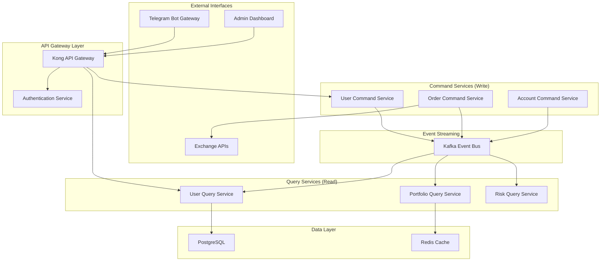

# PATRIOT Trading System - Production Architecture Documentation

## 📋 Document Overview

**Project:** PATRIOT Trading System - Multi-User Production Architecture  
**Version:** 2.0  
**Date:** September 2025  
**Authors:** Solution Architecture Team  
**Scope:** Complete system redesign from single-user MVP to production-ready multi-user hedge fund platform

---

## 🎯 Executive Summary

The PATRIOT trading system transformation involves migrating from a single-user MVP to a production-ready multi-user hedge fund platform capable of managing 100+ user accounts across multiple cryptocurrency exchanges. The system implements a hedge fund model where users provide API access and the platform manages their trading accounts through centralized strategies.

### Key Business Objectives
- **Scalable Multi-User Platform**: Support 100+ concurrent users with individual account management
- **Hedge Fund Operating Model**: Centralized strategy management with user account delegation
- **Multi-Exchange Integration**: Binance Futures and Bybit with extensible architecture
- **Administrative Control**: Comprehensive management tools for system operations
- **Revenue Generation**: Monthly percentage-based fees from account balance growth

### Technology Stack
- **Backend**: Python (FastAPI), Docker, Kafka, Redis, PostgreSQL
- **Architecture Patterns**: CQRS, Event-Driven, Microservices
- **Security**: JWT, API Gateway (Kong), encrypted API key storage
- **Monitoring**: Prometheus, Grafana, structured logging

---

## 📚 Documentation Structure

This documentation follows a progressive disclosure approach, allowing readers to dive deeper into specific areas as needed.

### Core Architecture Documents

| Document | Purpose | Target Audience |
|----------|---------|-----------------|
| **[01-SYSTEM-REQUIREMENTS](01-SYSTEM-REQUIREMENTS.md)** | Functional & non-functional requirements | All stakeholders |
| **[02-SYSTEM-ARCHITECTURE](02-SYSTEM-ARCHITECTURE.md)** | High-level architecture & design decisions | Architects, Senior Developers |
| **[03-COMPONENT-SPECIFICATIONS](03-COMPONENT-SPECIFICATIONS.md)** | Detailed service specifications | Development Team |
| **[04-INFRASTRUCTURE](04-INFRASTRUCTURE.md)** | DevOps, deployment, monitoring | DevOps, System Administrators |
| **[05-ARCHITECTURAL-DECISIONS](05-ARCHITECTURAL-DECISIONS.md)** | Decision records & rationale | Technical Leadership |
| **[06-IMPLEMENTATION-ROADMAP](06-IMPLEMENTATION-ROADMAP.md)** | Migration plan & phases | Project Management, Development |

### Supporting Documentation (Annexes)

| Document | Content | Reference Level |
|----------|---------|-----------------|
| **[ANNEX-A-DATA-SCHEMAS](annexes/ANNEX-A-DATA-SCHEMAS.md)** | Kafka topics, API schemas, data contracts | Implementation |
| **[ANNEX-B-DATABASE-DESIGN](annexes/ANNEX-B-DATABASE-DESIGN.md)** | ERD, table structures, relationships | Database Design |
| **[ANNEX-C-DEPLOYMENT-EXAMPLES](annexes/ANNEX-C-DEPLOYMENT-EXAMPLES.md)** | Docker Compose, configuration examples | DevOps |
| **[ANNEX-D-USE-CASES](annexes/ANNEX-D-USE-CASES.md)** | Use case diagrams, user scenarios | Business Analysis |
| **[ANNEX-E-API-DOCUMENTATION](annexes/ANNEX-E-API-DOCUMENTATION.md)** | REST API specifications, WebSocket streams | API Integration |

---

## 🚀 Quick Start Guide

### For New Team Members
1. Start with **[System Requirements](01-SYSTEM-REQUIREMENTS.md)** to understand business context
2. Review **[System Architecture](02-SYSTEM-ARCHITECTURE.md)** for technical overview  
3. Dive into **[Component Specifications](03-COMPONENT-SPECIFICATIONS.md)** for your area of responsibility

### For Architects & Technical Leads
1. Review **[Architectural Decisions](05-ARCHITECTURAL-DECISIONS.md)** for context on design choices
2. Study **[System Architecture](02-SYSTEM-ARCHITECTURE.md)** for complete technical design
3. Check **[Implementation Roadmap](06-IMPLEMENTATION-ROADMAP.md)** for migration strategy

### For DevOps Engineers
1. Start with **[Infrastructure](04-INFRASTRUCTURE.md)** for deployment architecture
2. Reference **[Deployment Examples](annexes/ANNEX-C-DEPLOYMENT-EXAMPLES.md)** for practical configurations
3. Review **[Data Schemas](annexes/ANNEX-A-DATA-SCHEMAS.md)** for data flow understanding

---

## 🔄 Document Maintenance

### Version Control
- **Major versions**: Significant architectural changes
- **Minor versions**: Component updates, new features
- **Patch versions**: Documentation improvements, corrections

### Change Management Process
1. **Architectural Decision**: Record in ADR format in document 05
2. **Impact Assessment**: Update affected component specifications
3. **Cross-Reference Update**: Ensure all references remain valid
4. **Implementation Tracking**: Update roadmap with progress

### Review Cycle
- **Monthly**: Review for accuracy against implementation
- **Quarterly**: Validate architectural decisions against business needs
- **Release-based**: Update for each major system deployment

---

## 🏗️ System Overview Diagram

---

## 📞 Contact & Support

**Architecture Team**: Dmytro Ustynov  
**Project Repository**: https://github.com/forecaster-ua/PATRIOT-trading-system  
**Documentation Issues**: [Issue Tracker URL]

---

> **Note**: This documentation represents the target production architecture. Current implementation status is tracked in the [Implementation Roadmap](06-IMPLEMENTATION-ROADMAP.md).
