# PATRIOT Trading System - Use Cases and User Scenarios

## 📋 Document Information

**Document ID**: ANNEX-D-USE-CASES  
**Version**: 2.0  
**Date**: September 2025  
**Authors**: Solution Architecture Team, Business Analysis Team  
**Status**: Draft  

> **Cross-References:**  
> - System Requirements: [../01-SYSTEM-REQUIREMENTS.md](../01-SYSTEM-REQUIREMENTS.md)  
> - System Architecture: [../02-SYSTEM-ARCHITECTURE.md](../02-SYSTEM-ARCHITECTURE.md)  
> - Component Specifications: [../03-COMPONENT-SPECIFICATIONS.md](../03-COMPONENT-SPECIFICATIONS.md)  
> - API Documentation: [ANNEX-E-API-DOCUMENTATION.md](ANNEX-E-API-DOCUMENTATION.md)

---

## 🎯 Use Case Overview

The PATRIOT trading system operates as a hedge fund platform where users delegate their exchange accounts to centralized trading strategies. This document outlines all primary and secondary use cases, user journeys, and interaction patterns.

### Actor Definitions

#### Primary Actors
- **End User (Trader)**: Individual providing exchange account access for automated trading
- **Administrator**: System operator managing strategies, users, and overall platform health
- **Strategy Manager**: Trading expert defining and monitoring trading strategies

#### Secondary Actors  
- **Exchange APIs**: External cryptocurrency exchanges (Binance, Bybit, etc.)
- **Telegram Bot API**: Communication channel with users
- **Monitoring Systems**: External monitoring and alerting services

---

## 👤 End User Use Cases

### UC-001: User Onboarding

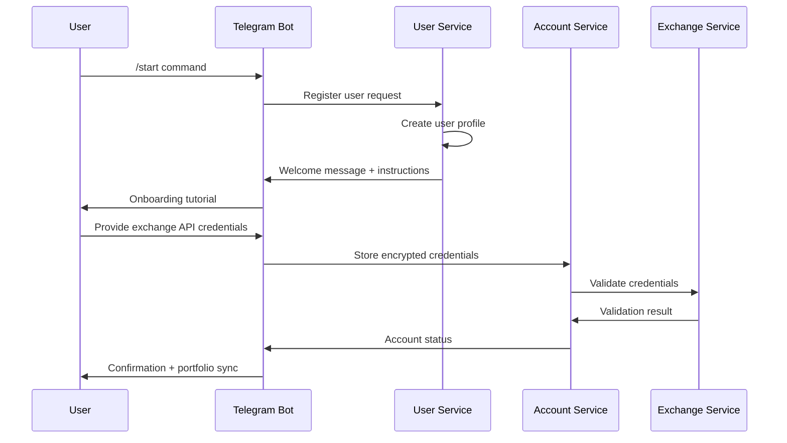

**Primary Flow:**
1. User initiates contact with Telegram bot
2. System creates user profile with basic information
3. Bot provides onboarding tutorial and instructions
4. User provides exchange API credentials (read-only initially)
5. System validates credentials with exchange
6. User grants trading permissions (API key upgrade)
7. System syncs initial portfolio data
8. User is assigned to default strategies based on risk profile

**Alternative Flows:**
- **AF-001A**: Invalid API credentials → System prompts for correction
- **AF-001B**: Exchange connectivity issues → System queues validation for retry
- **AF-001C**: User already exists → System updates existing profile

**Preconditions:**
- User has active Telegram account
- User has exchange account with API access enabled

**Postconditions:**
- User profile created in system
- Exchange account linked and validated
- Initial portfolio sync completed
- Default strategies assigned

### UC-002: Portfolio Monitoring

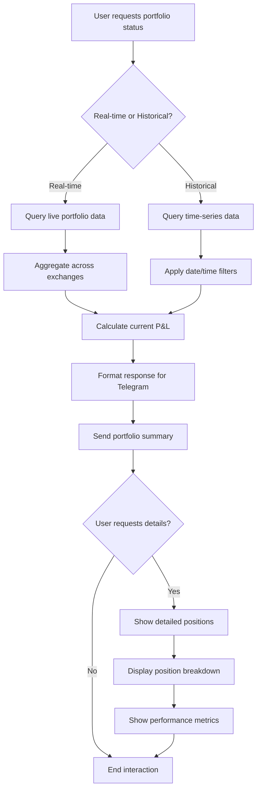

**Primary Flow:**
1. User requests portfolio status via Telegram command
2. System retrieves current portfolio data across all linked exchanges
3. System calculates consolidated P&L, positions, and performance metrics
4. Bot displays formatted portfolio summary
5. User can drill down into specific positions or time periods

**Performance Requirements:**
- Portfolio summary response within 2 seconds
- Real-time updates for active positions
- Historical data queries within 5 seconds

### UC-003: Strategy Management

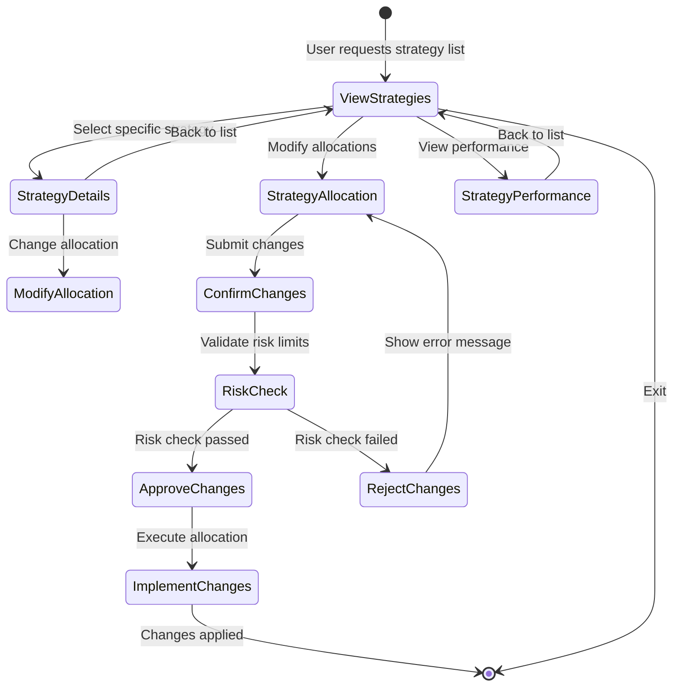

**Primary Flow:**
1. User views available strategies and current allocations
2. User selects strategy to modify allocation percentage
3. System validates allocation changes against risk limits
4. System applies changes and rebalances portfolio accordingly
5. User receives confirmation of changes

**Business Rules:**
- Total allocation across all strategies cannot exceed 100%
- Individual strategy allocation minimum: 5%
- Maximum strategies per user: 5
- Changes take effect at next rebalancing cycle

### UC-004: Risk Management and Alerts

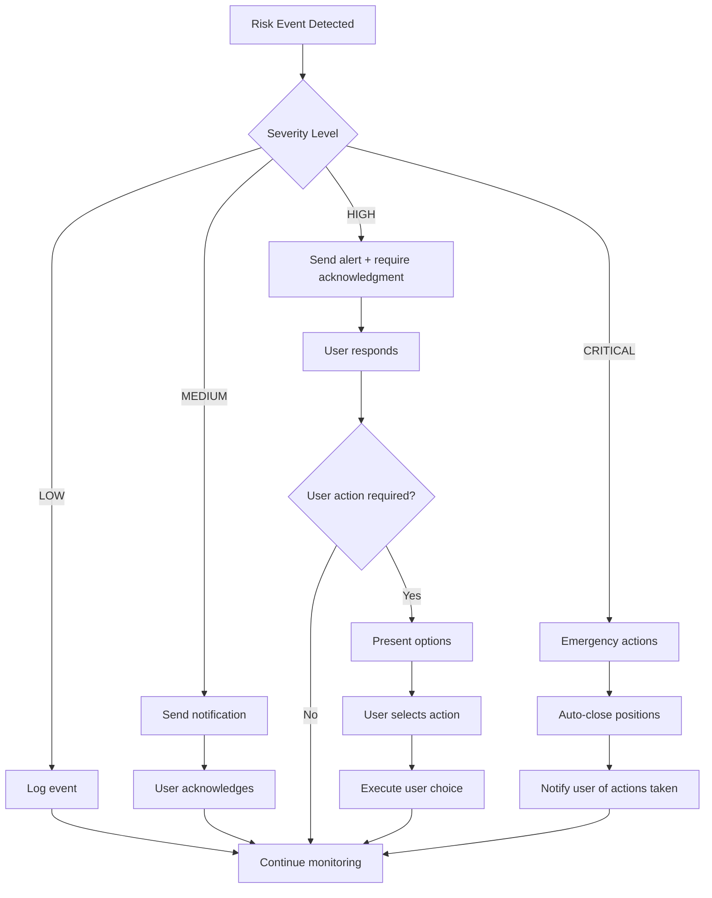

**Risk Event Types:**
- **Drawdown Alert**: Portfolio loss exceeds predefined threshold
- **Position Size Alert**: Single position exceeds risk limit
- **Correlation Alert**: Portfolio correlation risk too high
- **Liquidity Alert**: Market liquidity concerns for held positions

**Response Protocols:**
- **LOW**: Automated logging only
- **MEDIUM**: Telegram notification with current status
- **HIGH**: Urgent notification requiring user acknowledgment
- **CRITICAL**: Automatic position closure with immediate notification

---

## 👨‍💼 Administrator Use Cases

### UC-005: System Administration

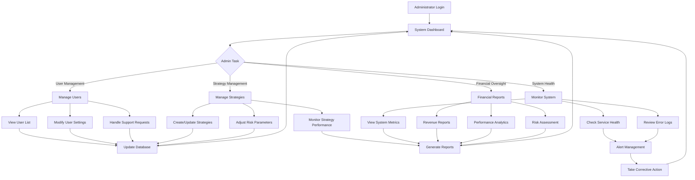

**Key Administrative Functions:**
1. **User Lifecycle Management**: Registration approval, account suspension, data cleanup
2. **Strategy Operations**: Deploy new strategies, adjust parameters, monitor performance
3. **System Monitoring**: Health checks, performance metrics, error investigation
4. **Financial Oversight**: Fee collection, profit sharing, regulatory reporting

### UC-006: Strategy Performance Analysis

**Primary Flow:**
1. Administrator accesses strategy performance dashboard
2. System displays key metrics: ROI, Sharpe ratio, max drawdown, win rate
3. Administrator can filter by time period, user segment, or strategy type
4. System generates comparative analysis against benchmarks
5. Administrator identifies underperforming strategies for optimization

**Key Metrics Tracked:**
- **Performance**: Total return, risk-adjusted returns, volatility
- **Risk**: Maximum drawdown, VaR, correlation metrics  
- **Operational**: Trade frequency, execution quality, slippage
- **User Impact**: Satisfaction scores, retention rates, fee generation

---

## 🔄 System Integration Use Cases

### UC-007: Exchange Integration

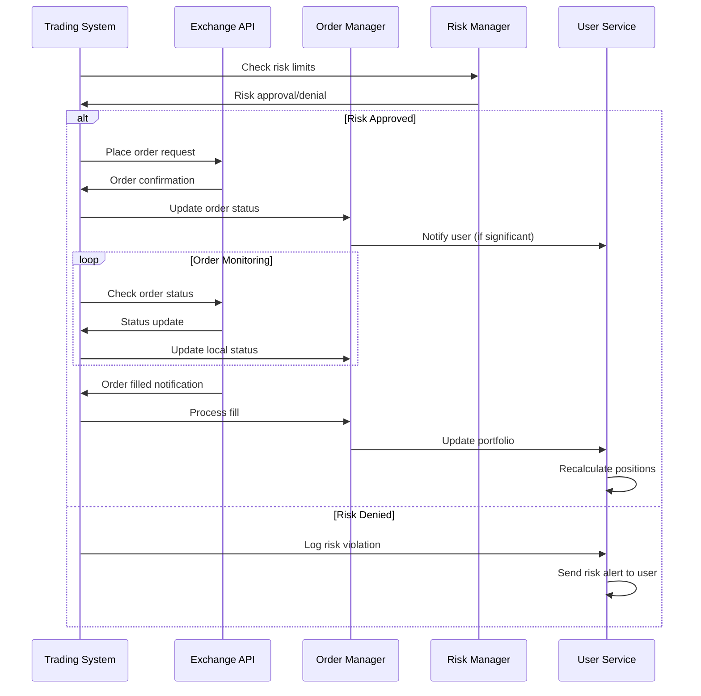

**Integration Patterns:**
- **Order Placement**: Async with confirmation tracking
- **Market Data**: Real-time WebSocket streams
- **Account Sync**: Periodic reconciliation with exchange balances
- **Error Handling**: Retry logic with exponential backoff

### UC-008: Data Synchronization

**Primary Flow:**
1. System initiates scheduled data sync across all user accounts
2. For each exchange account:
   - Fetch current balances and positions
   - Retrieve recent order history and fills
   - Update local database with new data
3. Detect and resolve data inconsistencies
4. Update user portfolio calculations
5. Generate sync reports for monitoring

**Synchronization Frequency:**
- **Real-time**: Active order status, critical balance changes
- **High-frequency**: Portfolio values, position updates (every 30 seconds)
- **Medium-frequency**: Order history, trade fills (every 5 minutes)  
- **Low-frequency**: Account settings, preferences (daily)

---

## 📱 Telegram Bot Interaction Patterns

### UC-009: Conversational Trading Interface

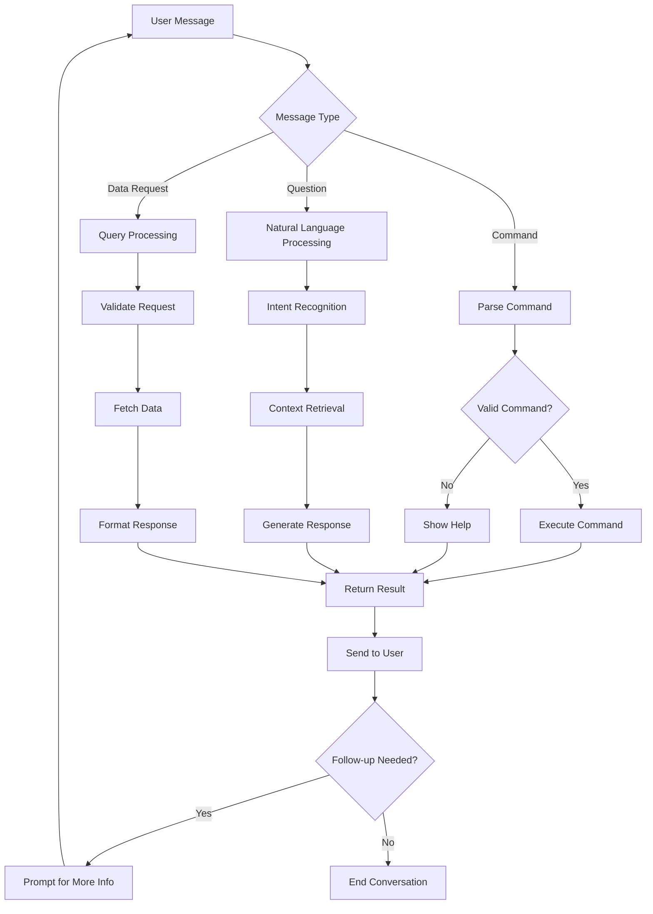

**Supported Interaction Types:**
1. **Commands**: `/portfolio`, `/strategies`, `/help`, `/settings`
2. **Natural Queries**: "How am I performing this week?", "Show me my BTCUSDT position"
3. **Quick Actions**: Inline keyboards for common operations
4. **Alerts**: Proactive notifications for important events

### UC-010: User Support and Help System

**Primary Flow:**
1. User requests help or encounters error
2. Bot provides contextual assistance based on user's current state
3. If issue persists, bot escalates to human support
4. Support ticket created with user context and conversation history
5. Administrator receives notification for ticket review

**Self-Service Capabilities:**
- **FAQ Integration**: Common questions with instant answers
- **Contextual Help**: Situation-specific guidance
- **Error Recovery**: Automated retry suggestions
- **Tutorial System**: Step-by-step guides for new features

---

## 🔒 Security and Compliance Use Cases

### UC-011: API Key Security Management

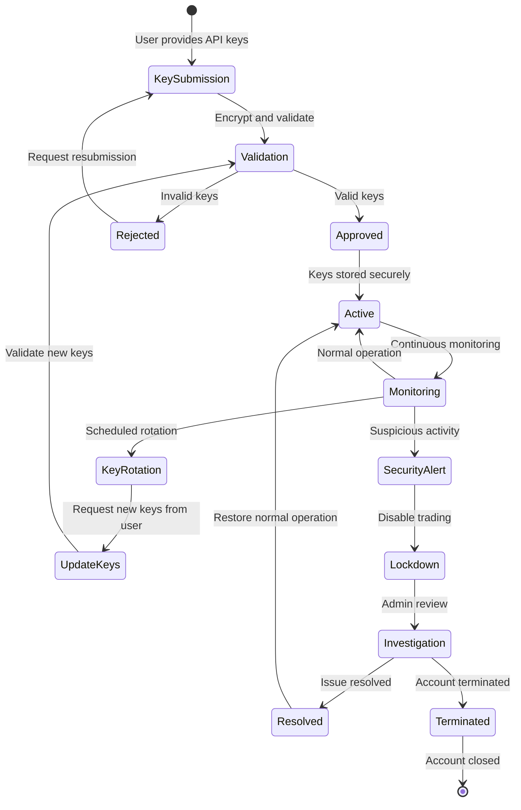

**Security Measures:**
- **Encryption**: AES-256 encryption for stored API keys
- **Access Control**: Role-based permissions for key access
- **Monitoring**: Continuous monitoring for unusual API usage
- **Rotation**: Periodic key rotation recommendations
- **Incident Response**: Automated response to security events

### UC-012: Compliance and Audit Trail

**Primary Flow:**
1. System continuously logs all trading activities
2. Audit trail includes: user actions, system decisions, external API calls
3. Regular compliance reports generated automatically
4. External auditor access provided through secure interface
5. Data retention managed according to regulatory requirements

**Audit Data Tracked:**
- **User Activities**: Login, settings changes, manual interventions
- **Trading Decisions**: Strategy triggers, risk checks, order placements
- **System Events**: Errors, performance issues, security incidents
- **Financial Flows**: Profit sharing, fee calculations, withdrawals

---

## 📊 Analytics and Reporting Use Cases

### UC-013: Performance Analytics

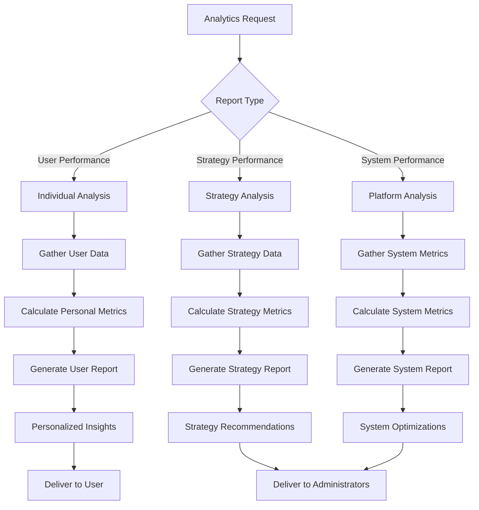

**Analytics Capabilities:**
- **Personal Performance**: Individual portfolio analysis with benchmarks
- **Strategy Effectiveness**: Comparative strategy performance analysis  
- **Risk Assessment**: Portfolio risk metrics and stress testing
- **Market Analysis**: Market condition impact on performance

### UC-014: Predictive Analytics

**Primary Flow:**
1. System collects historical performance and market data
2. Machine learning models analyze patterns and correlations
3. Predictive models generate forecasts for portfolio performance
4. Risk models identify potential future risk scenarios
5. Insights presented to users and administrators for decision-making

**Predictive Models:**
- **Performance Forecasting**: Expected returns based on historical patterns
- **Risk Prediction**: Probability of drawdown scenarios
- **Market Regime Detection**: Identification of changing market conditions
- **Strategy Optimization**: Recommended allocation adjustments

---

## 🎯 Business Process Use Cases

### UC-015: Fee Collection and Profit Sharing

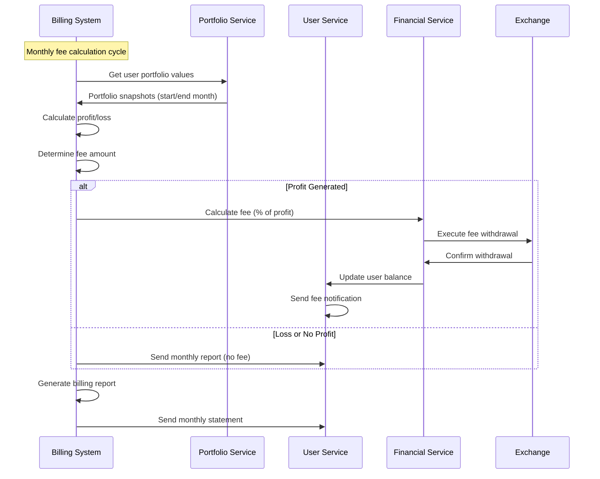

**Fee Structure:**
- **Performance Fee**: 30% of monthly profits (high-water mark)
- **No Management Fee**: Only profit-sharing model
- **Minimum Fee**: None (no fee if no profit)
- **Fee Calculation**: Monthly cycle with daily portfolio snapshots

### UC-016: Customer Lifecycle Management

**Onboarding to Churn Prevention:**

1. **Acquisition**: User discovers platform through referrals or marketing
2. **Onboarding**: Guided setup process with tutorial and support
3. **Activation**: First successful strategy allocation and trading activity
4. **Engagement**: Regular portfolio monitoring and strategy optimization
5. **Retention**: Performance satisfaction and continued platform usage
6. **Expansion**: Increased allocation or additional exchange accounts
7. **Advocacy**: User referrals and positive reviews

**Churn Prevention Measures:**
- **Performance Monitoring**: Proactive outreach for underperforming accounts
- **Education**: Regular market insights and strategy explanations
- **Support**: Responsive customer service and technical assistance
- **Incentives**: Referral bonuses and loyalty rewards

---

## 🔄 Error Scenarios and Exception Handling

### UC-017: System Failure Recovery

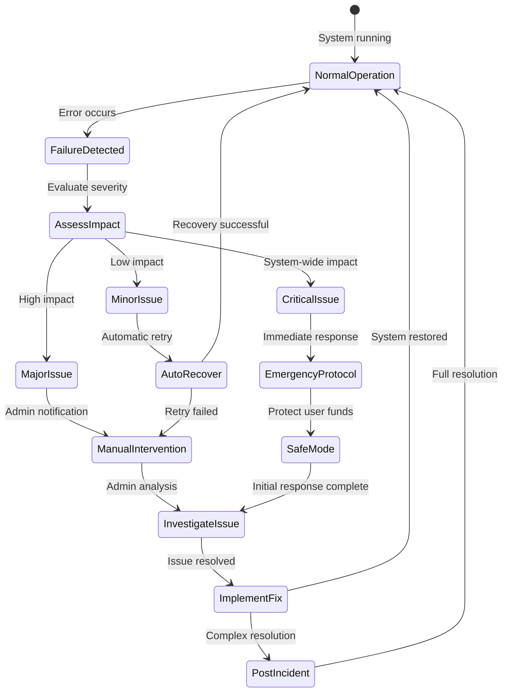

**Failure Categories:**
- **Exchange API Failures**: Connectivity, rate limiting, maintenance
- **System Component Failures**: Service crashes, database issues, network problems  
- **Data Inconsistencies**: Synchronization errors, calculation mistakes
- **Security Incidents**: Unauthorized access attempts, API key compromise

**Recovery Procedures:**
- **Automated Recovery**: Retry logic, circuit breakers, fallback mechanisms
- **Manual Intervention**: Administrator notification and guided resolution
- **Emergency Protocols**: Position closure, trading halt, user communication

---

## 📈 Scalability Use Cases

### UC-018: Platform Growth Management

**Growth Scenarios:**
1. **User Base Expansion**: 100 → 1,000 → 10,000 users
2. **Strategy Diversification**: 5 → 20 → 50 strategies  
3. **Exchange Integration**: 2 → 5 → 10 exchanges
4. **Geographic Expansion**: Single region → Multi-region deployment

**Scalability Measures:**
- **Horizontal Scaling**: Microservices scale independently based on demand
- **Data Partitioning**: User data sharded across multiple database instances
- **Caching Strategy**: Multi-level caching for frequently accessed data
- **CDN Integration**: Global content delivery for static assets and documentation

### UC-019: Performance Optimization

**Optimization Targets:**
- **Response Time**: Portfolio queries under 500ms (99th percentile)
- **Throughput**: 10,000+ concurrent users with <1% error rate
- **Latency**: Order placement under 100ms end-to-end
- **Availability**: 99.99% uptime with graceful degradation

**Performance Monitoring:**
- **Real-time Metrics**: Response times, error rates, resource utilization
- **Alerting**: Automated alerts for performance degradation
- **Capacity Planning**: Predictive scaling based on usage patterns
- **Optimization**: Continuous performance tuning and bottleneck resolution

---

> **Use Case Coverage Status:**
> - ✅ **Primary User Journeys**: Complete end-to-end scenarios documented
> - ✅ **Administrator Functions**: Comprehensive system management use cases
> - ✅ **Integration Patterns**: External system interaction scenarios  
> - ✅ **Error Handling**: Exception scenarios and recovery procedures
> - ✅ **Security & Compliance**: Audit trails and regulatory requirements
> - ✅ **Business Processes**: Revenue generation and customer lifecycle
> - ✅ **Scalability Scenarios**: Growth management and performance optimization

> **Business Value Alignment:**
> 1. **User Experience**: Intuitive Telegram interface with comprehensive portfolio management
> 2. **Risk Management**: Proactive monitoring and automated protection mechanisms
> 3. **Operational Efficiency**: Automated processes with minimal manual intervention
> 4. **Revenue Generation**: Clear profit-sharing model with transparent fee structure
> 5. **Regulatory Compliance**: Complete audit trails and secure data handling
> 6. **Platform Scalability**: Architecture supports 10x user growth without redesign

> **Next Steps:**
> 1. Validate use cases with stakeholders and users
> 2. Map use cases to component specifications and API requirements  
> 3. Create detailed user journey wireframes and prototypes
> 4. Develop comprehensive test scenarios based on use cases
> 5. Establish success metrics and KPIs for each use case category
